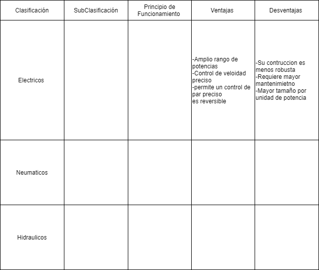

# Actuadores

## :trophy: C2.1 Reto en clase

**Actuadores Neumatico e Hidraulicos, y sus tipos**

### :blue_book: Instrucciones

- De acuerdo con la información presentada por el asesor referente al tema actuadores y a los videos observados sobre el mismo tema, elabore lo que se solicita dentro del apartado desarrollo.
- Toda actividad o reto se deberá realizar utilizando el estilo **MarkDown con extension .md** y el entorno de desarrollo VSCode, debiendo ser elaborado como un documento **single page**, es decir si el documento cuanta con imágenes, enlaces o cualquier documento externo debe ser accedido desde etiquetas y enlaces.
- Es requisito que el archivo .md contenga una etiqueta del enlace al repositorio de su documento en Github, por ejemplo **Enlace a mi GitHub**
- Al concluir el reto el reto se deberá subir a github el archivo .md creado.
- Desde el archivo **.md** se debe exportar un archivo **.pdf** con la nomenclatura **C2.1_NombreAlumno_Equipo.pdf**, el cual deberá subirse a classroom dentro de su apartado correspondiente, para que sirva como evidencia de su entrega; siendo esta plataforma **oficial** aquí se recibirá la calificación de su actividad por individual.
- Considerando que el archivo .pdf, fue obtenido desde archivo .md, ambos deben ser idénticos y mostrar el mismo contenido.
- Su repositorio ademas de que debe contar con un archivo **readme**.md dentro de su directorio raíz, con la información como datos del estudiante, equipo de trabajo, materia, carrera, datos del asesor, e incluso logotipo o imágenes, debe tener un apartado de contenidos o indice, los cuales realmente son ligas o **enlaces a sus documentos .md**, _evite utilizar texto_ para indicar enlaces internos o externo.
- Se propone una estructura tal como esta indicada abajo, sin embargo puede utilizarse cualquier otra que le apoye para organizar su repositorio.  
``` 
| readme.md
| | blog
| | | C2.1_x.md
| | | C2.2_x.md
| | | C2.3_x.md
| | img
| | docs
| | | A2.1_x.md
| | | A2.2_x.md
```

### :pencil2: Desarrollo

Listado de preguntas:

1. Basándose en el video [actuadores en Robótica](https://www.youtube.com/watch?v=e_6rjEGWqoY), realice un cuadro sinóptico sobre la clasificación de los actuadores.
   
   
2. De acuerdo con el video [descripcion de los actuadores industriales](https://www.youtube.com/watch?v=mFsPxpFHajM) realice una matriz comparativa indicando clasificacion, subclasificacion, principio de funcionamiento, ventajas y desventajas.
3. 
4. De acuerdo con el video [Neumática Industrial](https://www.youtube.com/watch?v=Wee85cI6wwQ&t=394s), explique como trabaja un sistema Neumático?

* Contiene 5 componentes muy comunes los cuales crean movimiento que realizará algún tipo de trabajo en un entorno industrial .Se comienza con el compresor el cual genera la energía del sistema que es el aire comprimido, después viaja por una manguera a la unidad de preparación de aire o FRL.
Primero pasa por un separador de líquidos el cual hace girar el aire utilizando paletas con forma especial esto sirve para eliminar la humedad y de ahí pasa al filtro el cual hace lo mismo que el separador de líquidos elimina partículas y la humedad en un proceso de dos etapas y funciona de la misma manera con giros para que circule el aire, en la segunda etapa el aire pasa por un filtro el cual funciona para atrapar los contaminantes no deseados, una vez limpio el aire se ajusta el compresor el cual será la fuerza que tendrá el sistema que se hace con una válvula interna la cual se abre y cierra depende la presión, Después cuando el aire está limpio va hacia una válvula de control direccional, el cual contiene una serie de vías internas que conectan el aire que llega al puerto de entrada con una o dos vías en la salida los cuales se llaman puertos de trabajo, el funcionamiento es que dependiendo de los carretes se decide si el aire estará bloqueado de un puerto para que pase por el otro o viceversa, los discos son los que impiden que pase el aire por un camino, cuando el carrete no está forzado está de lado izquierdo, si se desea accionar la válvula se debe de programar con un PLC el cual manda la señal eléctrica la cual se hace un campo magnético y se activa la válvula y así el aire pasará por el otro puerto después está conectado un Actuador el cual permite generar movimiento en varias direcciones, contiene una entrada para la entrada del aire cuando se manda la sesal en la válvula se activa el actuador el cual hace el movimiento hasta que toca el límite, el actuador necesita un comando para retraerse y es cuando la válvula no está del lado izquierdo hace que el pistón se retrae  lo cual genera un flujo de escape que este se crea cuando no se está utilizando una vía por ahi sale el aire que no se necesita y viceversa  y es así como funciona un actuador.


### :bomb: Rubrica

| Criterios     | Descripción                                                                                  | Puntaje |
| ------------- | -------------------------------------------------------------------------------------------- | ------- |
| Instrucciones | Se cumple con cada uno de los puntos indicados dentro del apartado Instrucciones?            | 20 |
| Desarrollo    | Se respondió a cada uno de los puntos solicitados dentro del desarrollo de la actividad?     | 80      |

:house: [Link GitHub](https://github.com/vanessamRodriguez/Sistemas_Programables)