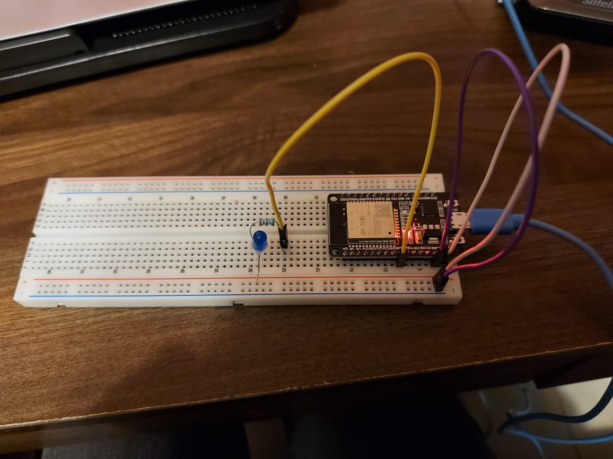
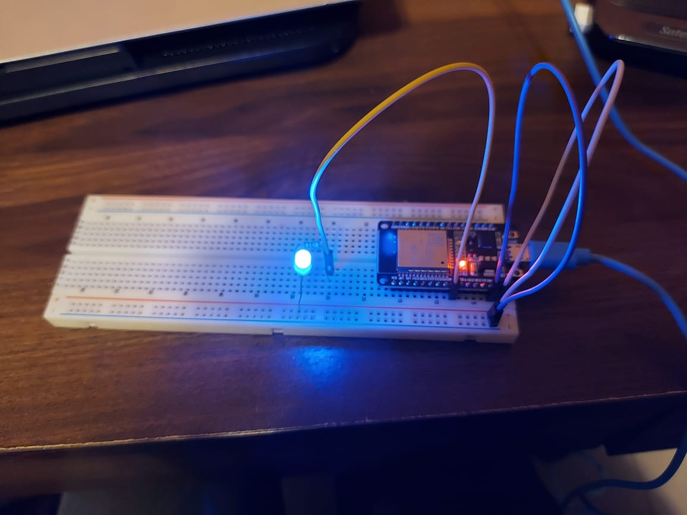
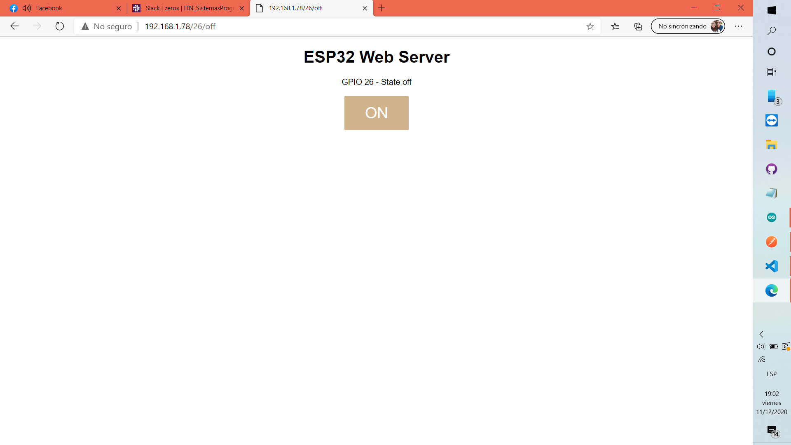
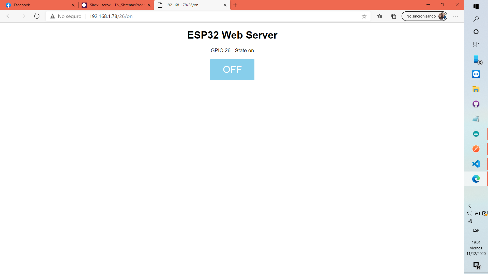
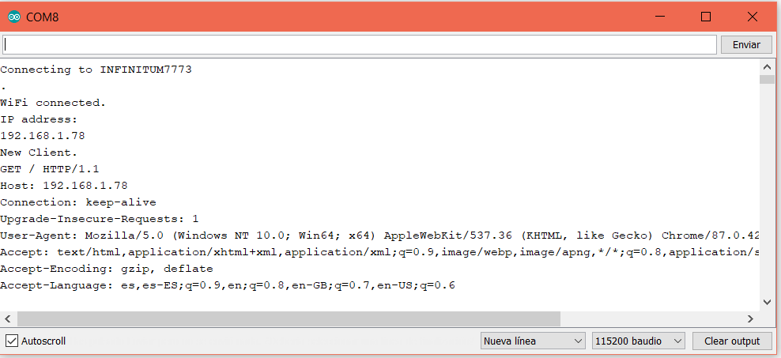

# :trophy: C4.2 Programación Microcontrolador NodeMCU ESP32

Comunicación por medio de la conexión Wi-Fi

___

## :blue_book: Instrucciones

- De acuerdo con la información presentada por el asesor referente al tema, desarrollar lo que se indica dentro del apartado siguiente.
- Toda actividad o reto se deberá realizar utilizando el estilo **MarkDown con extension .md** y el entorno de desarrollo VSCode, debiendo ser elaborado como un documento **single page**, es decir si el documento cuanta con imágenes, enlaces o cualquier documento externo debe ser accedido desde etiquetas y enlaces.
- Es requisito que el archivo .md contenga una etiqueta del enlace al repositorio de su documento en Github, por ejemplo **Enlace a mi GitHub**
- Al concluir el reto el reto se deberá subir a github el archivo .md creado.
- Desde el archivo **.md** se debe exportar un archivo **.pdf** con la nomenclatura **C4.2_NombreAlumno_Equipo.pdf**, el cual deberá subirse a classroom dentro de su apartado correspondiente, para que sirva como evidencia de su entrega; siendo esta plataforma **oficial** aquí se recibirá la calificación de su actividad por individual.
- Considerando que el archivo .pdf, fue obtenido desde archivo .md, ambos deben ser idénticos y mostrar el mismo contenido.
- Su repositorio ademas de que debe contar con un archivo **readme**.md dentro de su directorio raíz, con la información como datos del estudiante, equipo de trabajo, materia, carrera, datos del asesor, e incluso logotipo o imágenes, debe tener un apartado de contenidos o indice, los cuales realmente son ligas o **enlaces a sus documentos .md**, _evite utilizar texto_ para indicar enlaces internos o externo.
- Se propone una estructura tal como esta indicada abajo, sin embargo puede utilizarse cualquier otra que le apoye para organizar su repositorio.  


``` 
| readme.md
| | blog
| | | C4.1_TituloActividad.md
| | | C4.2_TituloActividad.md
| | | C4.3_TituloActividad.md
| | | C4.4_TituloActividad.md
| | | C4.5_TituloActividad.md
| | img
| | docs
| | | A4.1_TituloActividad.md
| | | A4.2_TituloActividad.md
```
___

## :pencil2: Desarrollo

1. Basado en el siguiente circuito, ensamblarlo, utilizando los elementos electrónicos observados.

<p align="center">
    
</p>

Fuente de consulta: [Random Nerd Tutorials]()

2. Analice y apóyese del programa que se muestra a continuación para elaborar el reto.

```C++
/*
 WiFi Web Server Simple
 */

#include <WiFi.h>
#include <WebServer.h>

const char* ssid = "<identificador>";
const char* password =  "<password>";

WebServer server(80);  // Object of WebServer(HTTP port, 80 is defult)

void setup() {
  Serial.begin(115200);
  Serial.println("Try Connecting to ");
  Serial.println(ssid);

  // Connect to your wi-fi modem
  WiFi.begin(ssid, password);

  // Check wi-fi is connected to wi-fi network
  while (WiFi.status() != WL_CONNECTED) {
  delay(1000);
  Serial.print(".");
  }
  Serial.println("");
  Serial.println("WiFi connected successfully");
  Serial.print("Got IP: ");
  Serial.println(WiFi.localIP());  //Show ESP32 IP on serial

  server.on("/", handle_root);

  server.begin();
  Serial.println("HTTP server started");
  delay(100); 
}

void loop() {
  server.handleClient();
}

// HTML & CSS contents which display on web server
String HTML = "<!DOCTYPE html>\
<html>\
<body>\
<h1>Mi Primer Servidor Web with ESP32 - Station Mode &#128522;</h1>\
</body>\
</html>";

// Handle root url (/)
void handle_root() {
  server.send(200, "text/html", HTML);
}
```

3. Pruebe y observe los resultados obtenidos explicándolos en esta sección.
   
**En este codigo se logra obtener la IP para ingresar a la pagina web la cual tiene un titulo que dice Mi primer Servidor Web basandonos en eso se le agregara el boton que se mostrara el codigo en el siguiente apartado**
4. Al programa anterior agregue las instrucciones necesarias para que se despliegue en la interface un botón que permita encender y apagar un Led tal como se muestra en la figura 1.
```C++
void loop(){
  WiFiClient client = server.available();   // Escuche a los clientes entrantes

  if (client) {                             // Si un nuevo cliente se conecta,
    currentTime = millis();
    previousTime = currentTime;
    Serial.println("New Client.");          // imprime un mensaje en el puerto serie
    String currentLine = "";                // hacer una cadena para contener los datos entrantes del cliente
    while (client.connected() && currentTime - previousTime <= timeoutTime) {  // Bucle mientras los clientes se conectaron
      currentTime = millis();
      if (client.available()) {             //Si hay bytes para leer del cliente,
        char c = client.read();             // leer un byte, luego
        Serial.write(c);                    // imprímalo en el monitor de serie
        header += c;
        if (c == '\n') {                    // si el byte es un carácter de nueva línea
          //si la línea actual está en blanco, tiene dos caracteres de nueva línea seguidos.
          // ese es el final de la solicitud HTTP del cliente, así que envíe una respuesta:
          if (currentLine.length() == 0) {
            //Los encabezados HTTP siempre comienzan con un código de respuesta (por ejemplo, HTTP / 1.1 200 OK)
            // y un tipo de contenido para que el cliente sepa lo que viene, luego una línea en blanco:
            client.println("HTTP/1.1 200 OK");
            client.println("Content-type:text/html");
            client.println("Connection: close");
            client.println();
            
            //enciende y apaga los GPIO
            if (header.indexOf("GET /26/on") >= 0) {
              Serial.println("GPIO 26 on");
              output26State = "on";
              digitalWrite(output26, HIGH);
            } else if (header.indexOf("GET /26/off") >= 0) {
              Serial.println("GPIO 26 off");
              output26State = "off";
              digitalWrite(output26, LOW);
            } 
            
            // Diseño HTTP
            client.println("<!DOCTYPE html><html>");
            client.println("<head><meta name=\"viewport\" content=\"width=device-width, initial-scale=1\">");
            client.println("<link rel=\"icon\" href=\"data:,\">");
            // Diseño CSS de los botones  
        
            client.println("<style>html { font-family: Helvetica; display: inline-block; margin: 0px auto; text-align: center;}");
            client.println(".button { background-color: #D2B48C; border: none; color: white; padding: 16px 40px;");
            client.println("text-decoration: none; font-size: 30px; margin: 2px; cursor: pointer;}");
            client.println(".button2 {background-color: #87CEEB;}</style></head>");
            
           
            client.println("<body><h1>ESP32 Web Server</h1>");
            
            //Muestra el estado actual y los botones ON / OFF para GPIO 26
            client.println("<p>GPIO 26 - State " + output26State + "</p>");
            // Si output26State está apagado, muestra el botón ON     
            if (output26State=="off") {
              client.println("<p><a href=\"/26/on\"><button class=\"button\">ON</button></a></p>");
            } else {
              client.println("<p><a href=\"/26/off\"><button class=\"button button2\">OFF</button></a></p>");
            } 
               
            client.println("</body></html>");
            
            // La respuesta HTTP termina con otra línea en blanco
            client.println();
            // Salir del bucle while
            break;
          } else { // si tiene una nueva línea, borre la línea actual
            currentLine = "";
          }
        } else if (c != '\r') {  // si tiene algo más que un carácter de retorno de carro,
          currentLine += c;      // agréguelo al final de la línea actual
        }
      }
    }
    //Borrar la variable de encabezado
    header = "";
    // Cerrar la conexión
    client.stop();
    Serial.println("Client disconnected.");
    Serial.println("");
  }
}
```
5. Inserte aquí las imágenes que considere como evidencias para demostrar el resultado obtenido.

[Video Demostrativo](https://youtu.be/1HjZ5_bYBI8)






___

### :bomb: Rubrica

| Criterios     | Descripción                                                                                  | Puntaje |
| ------------- | -------------------------------------------------------------------------------------------- | ------- |
| Instrucciones | Se cumple con cada uno de los puntos indicados dentro del apartado Instrucciones?            | 20 |
| Desarrollo    | Se respondió a cada uno de los puntos solicitados dentro del desarrollo de la actividad?     | 80      |

:house: [Link  Díaz Navarro Alejandro](https://github.com/AlejandroDiaz96/SistemasProgramables2020)

:house: [Link Rodríguez Báez Vanessa Marlenne](https://github.com/vanessamRodriguez/Sistemas_Programables)

:house: [Link Soria Márquez Guillermo](https://github.com/GuillermoSoria97/Sistemas_P)