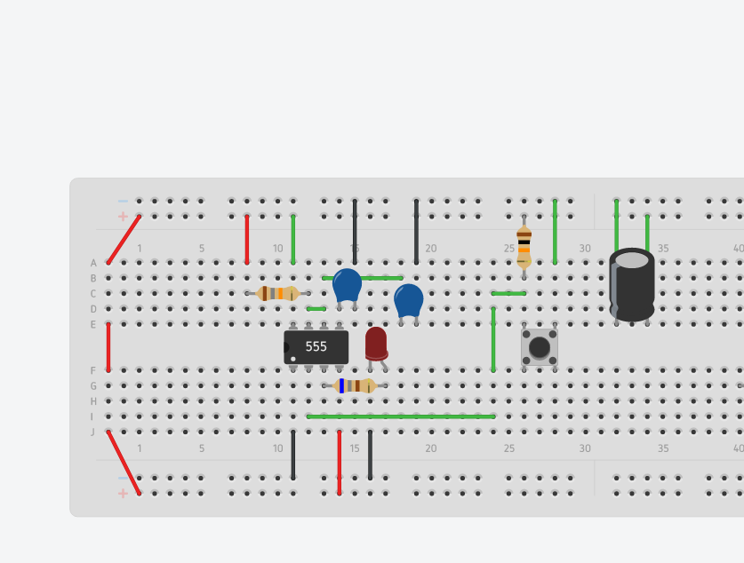

# Actuadores

# :trophy: A.2.2 Actividad de aprendizaje

 Realizar un sistema de control de arranque y encendido para un actuador eléctrico a través de un circuito electrónico, utilizando un simulador, un **Temporizador NE55s** y un **Motor de DC**.


### :blue_book: Instrucciones

- Se sugiere para el desarrollado de la presenta actividad, utilice uno de los siguientes simuladores: [Autodesk Tinkercad](https://www.tinkercad.com/), [Virtual BreadBoard](http://www.virtualbreadboard.com/), [Easy EDA](https://easyeda.com/) por lo cual habrá que familiarizarse antes, e incluso instalarse o registrarse dentro de la plataforma.
- Toda actividad o reto se deberá realizar utilizando el estilo **MarkDown con extension .md** y el entorno de desarrollo VSCode, debiendo ser elaborado como un documento **single page**, es decir si el documento cuanta con imágenes, enlaces o cualquier documento externo debe ser accedido desde etiquetas y enlaces, y debe ser nombrado con la nomenclatura **A2.2_NombreApellido_Equipo.pdf.**
- Es requisito que el .md contenga una etiqueta del enlace al repositorio de su documento en GITHUB, por ejemplo **Enlace a mi GitHub** y al concluir el reto se deberá subir a github.
- Desde el archivo **.md** exporte un archivo **.pdf** que deberá subirse a classroom dentro de su apartado correspondiente, sirviendo como evidencia de su entrega, ya que siendo la plataforma **oficial** aquí se recibirá la calificación de su actividad.
- Considerando que el archivo .PDF, el cual fue obtenido desde archivo .MD, ambos deben ser idénticos.
- Su repositorio ademas de que debe contar con un archivo **readme**.md dentro de su directorio raíz, con la información como datos del estudiante, equipo de trabajo, materia, carrera, datos del asesor, e incluso logotipo o imágenes, debe tener un apartado de contenidos o indice, los cuales realmente son ligas o **enlaces a sus documentos .md**, _evite utilizar texto_ para indicar enlaces internos o externo.
- Se propone una estructura tal como esta indicada abajo, sin embargo puede utilizarse cualquier otra que le apoye para organizar su repositorio.
  
```
- readme.md
  - blog
    - C2.1_x.md
    - C2.2_x.md
  - img
  - docs
    - A2.1_x.md
    - A2.2_x.md
```
### :pencil2: Desarrollo

1.Utilice el siguiente listado de materiales para la elaboración de la actividad

| Cantidad | Descripción                            |
| -------- | -------------------------------------- |
| 1        | [Circuito integrado LM555](https://sites.google.com/site/tallerroboticanova/integrado-555?fbclid=IwAR0T01Ib0aMzzqpREoXnsm_0mhjZcGF8lvMEuznOd1KmSzYQ6MNQcI6O3UA)              |
| 1        | [Capacitor electrolítico de 47uf](https://tostatronic.com/store/es/componentes-pasivos/854-capacitor-electrolitico-47uf-50v.html?fbclid=IwAR3nmXA9FWUfZeIbqdYO4HuAyjOwpgqQNcjn1dmLe7WrLm54nyWJmqw4l5M)        |
| 1        | [Condensador cerámico de 10nf](http://www.geekbotelectronics.com/producto/capacitor-ceramico-10-nf-50-v/?fbclid=IwAR05bl6xDojGcq1rOqH6GnMJtZbuqOGiH4AvOXjdTIL3kE3ivL_GY2WbA6U)           |
| 1        | [Fuente de voltaje de 9V](https://sandorobotics.com/producto/hr0177-12/?fbclid=IwAR0INQ3PB0HCGN1SEBrg6Od2LbwqA4cvd6yL3qvWkuoCqw6z5FMe6jBI-_4)                |
| 1        | [Transistor de poder TIP122](https://sandorobotics.com/producto/tip122/?fbclid=IwAR1rW4L0cDLDQ_qJ_uQNDFEq_6aTlpLHMZqOt7jgxpxSxlz1mQtOEHNJNN8)             |
| 1        | [Diodo 1N4001 o equivalente](https://hetpro-store.com/diodo-rectificador-1n4001/?fbclid=IwAR1sE9Q_Ay9AevpJ_MDwjU0eAdnhEXn7oTmwpF_UoBkOq0l677tnlAuulFg)             |
| 1        | [Mini Motor DC](https://www.steren.com.mx/mini-motor-de-corriente-directa.html?fbclid=IwAR1ekiOL2yA_aqB69xfYra7mjtZlCStUgrdEIJR1dRU1jABcqGtvOMJMnEA)                          |
| 3        | Resistencias [680](http://www.geekbotelectronics.com/producto/resistencia-680-ohm-14-w/?fbclid=IwAR0X_4_l34vB8xJWbJg2jNNImm--UeAd23Y3r_KjCmvOQH-AOQoZEsS8xS0),[1k](https://www.electrocomponentes.es/resistencias/resistencia-1k-ohm-025w-39-.html?fbclid=IwAR2WynoI5RRZnuklRp-rYgUy-X-wyDghtCcOwK86DTpIJhfD2Hoe3-a_vc4),[10k](https://www.electrocomponentes.es/resistencias/resistencia-10k-ohm-025w-49-.html?fbclid=IwAR3gh2ng8iJIT0vpTKwnE3p5hw75oYVP8tMc5Rw6SsBpWof_PBuqHEFrYa4#:~:text=Peque%C3%B1a%20resistencia%20de%20pel%C3%ADcula%20de,de%20trabajo%20de%20hasta%20300v) Ohmios de 1/4w |
| 1        | [Pulsador de disparo](https://www.diarioelectronicohoy.com/blog/pulsadores-sin-rebotes?fbclid=IwAR2FCOL3OVsaLGEjd_OViWb15EJQpf9OrhL5Kn6YapnTKC2-sOA5HSqkxyE)                    |
| 1        | [Diodo Led Rojo](http://www.geekbotelectronics.com/producto/led-difuso-rojo-5-mm/?fbclid=IwAR3UZTDFrPCM1_jq0bSiGj8WZhIjZLJ09N4q7naL98_LEmlQLrUJ095xO7U)                         |

2. Utilice el circuito electrónico de la imagen siguiente y ensamble la etapa 1 dentro del simulador.

<p align="center">
    
</p>



3. Como se podrá observar en el circuito anterior existe un area identificada como "Red de tiempo" y otra "Filtro de desacople", **explique el proposito de ambos terminologias**.
   
  - **Red de tiempo:** La red de tiempo es donde se va a modificar los valores de la resistencia y el capacitor para asi el led dure el tiempo que se desea para la practica.
  - **Filtro de desacople:** Se utiliza para conducir corriente alterna alrededor de un componente o un grupo de componentes. Se ocupa del ruido, al ayudar a crear una señal de corriente continua más limpia. Al llevar las señales de CA a tierra, todo el ruido de una señal de CC se elimina de forma efectiva.

4. Continuando con la imagen anterior, observe se muestra la ecuación Ct= 1.1 * R1 * C1, la cual es utilizada para establecer el tiempo de **encendido del pulso de salida**. Basándose en esa ecuación anterior calcule los valores de **R1 y C1** si se desea mantener encendido el pulso de salida, dada las 3 condiciones requeridas en la tabla anexa.

    | Numero | Condición  | Valor de R1 | Valor de C1 |
    | ------ | ---------- | ----------- | ----------- |
    | 1      | 3 segundos |   18K ohms          |   160mf          |
    | 2      | 5 segundos | 20k Ohms            | 228mf            |
    | 3      | 8 segundos | 33K ohms            |  221mf          |

## **Operaciones**

**Formula**

Ct= 1.1 * R1 * C1
- **3 segundos**
  
  R1= 18K ohms
  
  C1= 160 Mf

  Ct= 1.1 * 18,000 * 0.000160 = **3.16 seg**

 - **5 segundor**

  R1= 20k ohms

  C1= 228 Mf

  Cf= 1.1 * 20,000 * 0.000228 = **5.016 seg**

 - **8 Segundos**

R1= 33K ohms

C1= 221 Mf

Ct= 1.1 * 33,000 * 0.000221= **8.02 seg**

5. Una vez que se halla completado la tabla anterior, inicie la simulación para cualquiera de las tres condiciones y observe el comportamiento del Led;  **explique su observación**.
   
- Para iniciar el encendido del led se debe presionar el botón lo cual conlleva que pasado el tiempo el cual le asgnemos con los valores de R1 y C1 este se apaga.
  
6. Ensamble la etapa 2 e integre la terminal del pulso de salida a la entrada de la base del transistor de esta segunda etapa.
   
   
7. Una vez concluido el paso anterior, elija una de las 3 condiciones registradas en la tabla anterior y observe el comportamiento del motor DC; **explique su observación**.

- Al presionar el botón el led enciende con ello el motor empieza a trabajar durante el tiempo que led esté encendido una vez este se apague el motor dejara de seguir su marcha.

8. Una vez que el tiempo de encendido del pulso de salida de la etapa 1 se completo, **que sucede con el motor DC? Explique la razon de este comportamiento?**
- El circuito 555 deja de enviar la señal lo cual hace que el transistor ya no recibe ninguna señal los cual provoca que el motor ya no siga trabajando y termina deteniéndose.
- 
9.  Conclusiones 
- **Diaz Navarro Alejandro:** Anteriormente nunca había manipulado un integrado en este caso el 555, esta es la primer ocasión en que me toca trabajar con uno de esto y me ayudó para comprender como este trabaja junto con los demás componentes, y cómo modificando los valores en determinados componentes estos provocan el tiempo de apagado del led y asu vez como el 555 una vez deja de enviar la señal al motor provoca que este deje de trabajar.
- **Rodríguez Báez Vanessa Marlenne:** En esta practica se trabajo con un temporizador 555 el cual controla el tiempo de encendido de uno o varios componentes, esta practica la verdad si me ayudo muchísimo al momento de volver a recordar el como era trabajar con este temporizador, al igual con el transistor lo cual es muy fácil su uso ya que cada patita tiene su propósito y su conexión se me hizo muy fácil en la que batalle fue en la
conexión del 555.

- **Soria Márquez Guillermo:** En esta practica se trabajo con el temporizador 555 y con un motor de corriente directa,al principio yo no sabia cual era la funcionalidad de cada patita. Yo nunca habia trabajado con este temporizador pero me di cuenta que distribuye la señal con respecto al tiempo, en este caso el LED utilizado en la etapa 1 duro 3 segundos encendido y porteriormente se apago, cuando le agregamos la etapa 2 el motor tenia el mismo comportamiento que el led y funcionaban simultaneamente.
1.   Evidencia 


### :bomb: Rubrica

| Criterios     | Descripción                                                                                  | Puntaje |
| ------------- | -------------------------------------------------------------------------------------------- | ------- |
| Instrucciones | Se cumple con cada uno de los puntos indicados dentro del apartado Instrucciones?            | 10      |
| Desarrollo    | Se respondió a cada uno de los puntos solicitados dentro del desarrollo de la actividad?     | 60      |
| Demostración  | El alumno se presenta durante la explicación de la funcionalidad de la actividad?            | 20      |
| Conclusiones  | Se incluye una opinión personal de la actividad  por cada uno de los integrantes del equipo? | 10      |


:house: [Link  Díaz Navarro Alejandro](https://github.com/AlejandroDiaz96/SistemasProgramables2020)

:house: [Link Rodríguez Báez Vanessa Marlenne](https://github.com/vanessamRodriguez/Sistemas_Programables)

:house: [Link Soria Márquez Guillermo](https://github.com/GuillermoSoria97/Sistemas_P)

