# :trophy: A.3.1 Actividad de aprendizaje

Circuito sensor de detección de objetos, utilizando un Arduino, un sensor ultrasonico y un Display I2C LCD 16x2.
___

## Instrucciones

- Realizar un sistema simulado, capaz de detectar la presencia y/o ausencia de un objeto, a través de un circuito electrónico, utilizando un Arduino, y un **Sensor Ultrasonico HC-SR04**.
- Toda actividad o reto se deberá realizar utilizando el estilo **MarkDown con extension .md** y el entorno de desarrollo VSCode, debiendo ser elaborado como un documento **single page**, es decir si el documento cuanta con imágenes, enlaces o cualquier documento externo debe ser accedido desde etiquetas y enlaces, y debe ser nombrado con la nomenclatura **A3.1_NombreApellido_Equipo.pdf.**
- Es requisito que el .md contenga una etiqueta del enlace al repositorio de su documento en GITHUB, por ejemplo **Enlace a mi GitHub** y al concluir el reto se deberá subir a github.
- Desde el archivo **.md** exporte un archivo **.pdf** que deberá subirse a classroom dentro de su apartado correspondiente, sirviendo como evidencia de su entrega, ya que siendo la plataforma **oficial** aquí se recibirá la calificación de su actividad.
- Considerando que el archivo .PDF, el cual fue obtenido desde archivo .MD, ambos deben ser idénticos.
- Su repositorio ademas de que debe contar con un archivo **readme**.md dentro de su directorio raíz, con la información como datos del estudiante, equipo de trabajo, materia, carrera, datos del asesor, e incluso logotipo o imágenes, debe tener un apartado de contenidos o indice, los cuales realmente son ligas o **enlaces a sus documentos .md**, _evite utilizar texto_ para indicar enlaces internos o externo.
- Se propone una estructura tal como esta indicada abajo, sin embargo puede utilizarse cualquier otra que le apoye para organizar su repositorio.
  
```
- readme.md
  - blog
    - C3.1_TituloActividad.md
    - C3.2_TituloActividad.md
    - C3.3_TituloActividad.md
    - C3.4_TituloActividad.md
    - C3.5_TituloActividad.md
    - C3.6_TituloActividad.md
    - C3.7_TituloActividad.md
    - C3.8_TituloActividad.md
  - img
  - docs
    - A3.1_TituloActividad.md
    - A3.2_TituloActividad.md
    - A3.3_TituloActividad.md
```
___

## Desarrollo

1. Utilizar el siguiente listado de materiales para la elaboración de la actividad

| Cantidad | Descripción                                                                                                                                                                                                                        |
| -------- | ---------------------------------------------------------------------------------------------------------------------------------------------------------------------------------------------------------------------------------- |
| 1        | Sensor [Ultrasonico HC-SR04](https://www.amazon.com.mx/SainSmart-HC-SR04-Ranging-Detector-Distance/dp/B004U8TOE6/ref=sr_1_5?__mk_es_MX=%C3%85M%C3%85%C5%BD%C3%95%C3%91&dchild=1&keywords=hc-sr04&qid=1599005012&sr=8-5)            |
| 1         | [Display LCD de 16x2](https://www.geekfactory.mx/tutoriales/tutoriales-arduino/pantalla-lcd-16x2-con-arduino/?fbclid=IwAR21v0lNRIine5lvZpiUjMcHcxodG8vomoTNkgWpB2VfRrJfr172B5Qwtsk)
| 1        | [Fuente de voltaje de 5V](https://cdmxelectronica.com/producto/fuente-de-alimentacion-5v-10a/?fbclid=IwAR2q2GhBGhdg2lGAqUe11LBlw06NYi_424_SLQtJxtn-wJ3rLRbHUrz3PbY)                                                                                                                                                                                                         |
| 1        | [1 Potenciómetro 10k ](https://www.amazon.com.mx/Uxcell-a15011600ux0235-Linear-Rotary-Potentiometer/dp/B01DKCUVMQ/ref=sr_1_1?__mk_es_MX=%C3%85M%C3%85%C5%BD%C3%95%C3%91&dchild=1&keywords=potenciometro+10k&qid=1599005041&sr=8-1) |
| 1        | [Arduino UNO](https://www.amazon.com.mx/Progressive-Automations-LC-066-Arduino-Rev3/dp/B00WH5XOJK/ref=sr_1_7?__mk_es_MX=%C3%85M%C3%85%C5%BD%C3%95%C3%91&dchild=1&keywords=arduino+uno&qid=1599005073&sr=8-7)                       |

2. Basado en la imágen que se muestra, ensamble dentro del simulador a utilizar, el circuito electrónico indicado en la **Figura 1**.

<p align="center"> <b>Figura 1 Sensor Ultrasonico</b>
    
</p>

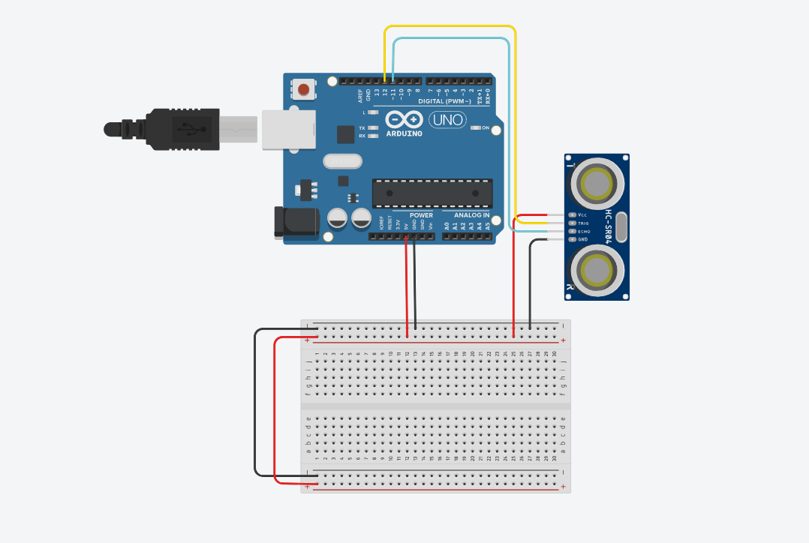

3. Realice el programa que permita a través de una de las entradas del Arduino, recibir el valor que registra el **Sensor Ultrasonico** al acercarse un objeto a distintas distancias.
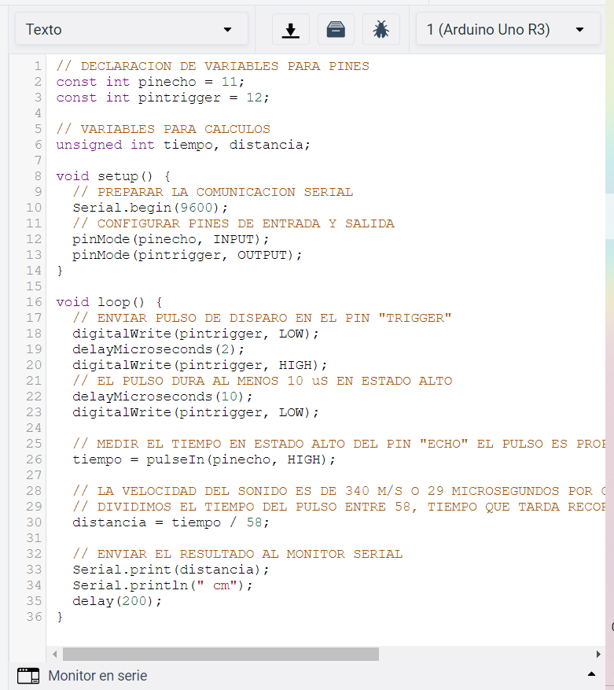
4. Considerando que el sensor ultrasonico tiene un rango mínimo y máximo de detección basado en el tiempo de retorno de la señal sonica, que valores se obtienen en la simulación bajo las **siguientes condiciones:**

| Numero | Condición 1                   | Condición2                                 | El objeto es detectado? |
| ------ | ----------------------------- | ------------------------------------------ | ----------------------- |
| 1      | 5 cm de distancia al sensor   | 0 grados al eje perpendicular del sensor   |El objeto si es detectado
| 2      | 50 cm de distancia al sensor  | 35 grados al eje perpendicular del sensor  |El objeto si es detectado
| 3      | 100 cm de distancia al sensor | -35 grados al eje perpendicular del sensor |El objeto si es detectado
| 4      | 5 cm de distancia al sensor   | 90 grados al eje perpendicular del sensor  |El objeto no es detectado
| 5      | 50 cm de distancia al sensor  | -60 grados al eje perpendicular del sensor |El objeto si es detectado
| 6      | 350 cm de distancia al sensor | 0 grados al eje perpendicular del sensor   |El objeto no es detectado

5. Una vez completados los puntos anteriores, agregue a la Figura 1, **un Display I2C 16x2 LCD**, y coloque la imagen del circuito completado hasta este apartado.
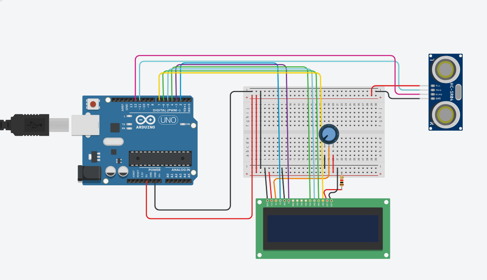

6. Al haber completado la integración del Display I2C, ajuste el programa que le permita a través del display mostrar el siguiente mensaje, **"Objetivo detectado a ? cm** , y en caso de no lograr la detección indicar el mensaje **"Objetivo fuera de rango"**
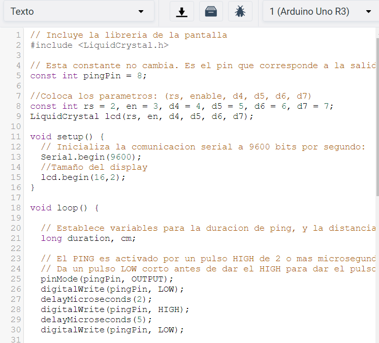
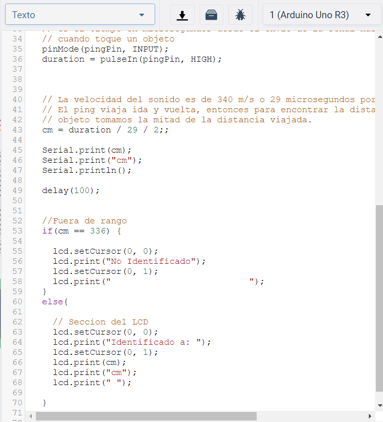
7. Coloque aqui evidencias que considere importantes durante el desarrollo de la actividad.
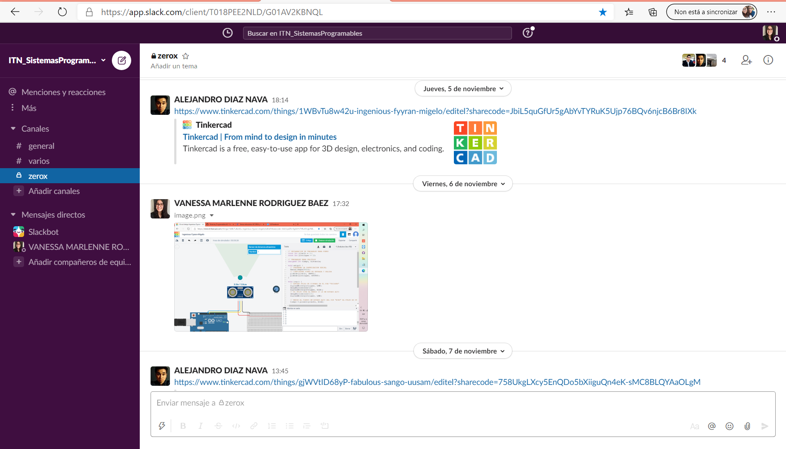
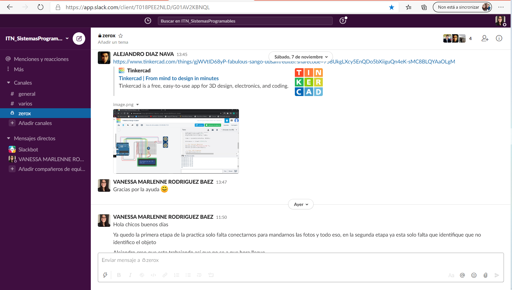
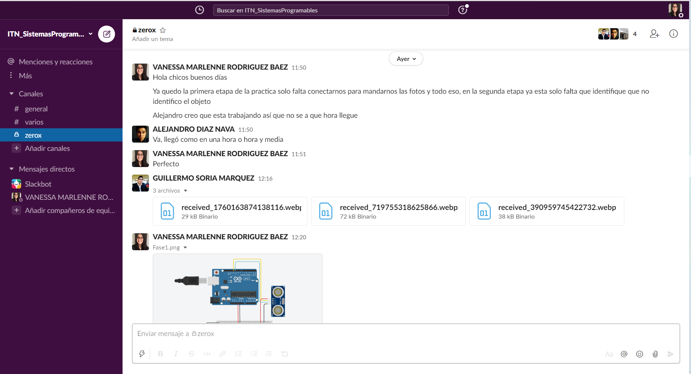
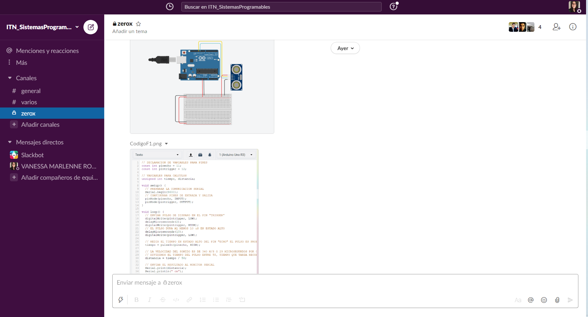
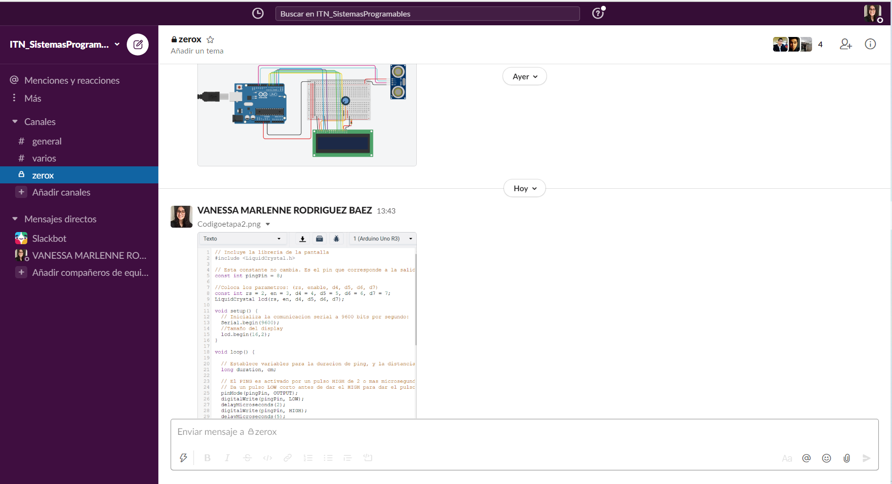
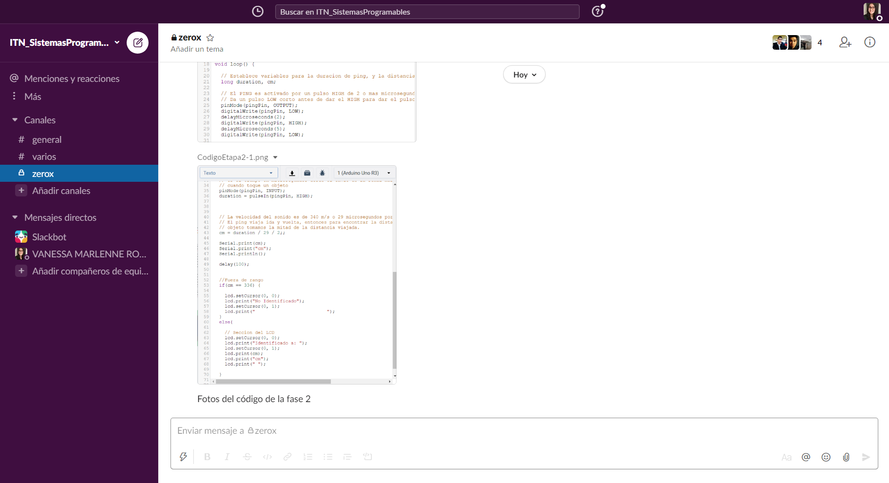

8. **Conclusiones**

* **Diaz Navarro Alejandro:**
* **Rodríguez Báez Vanessa Marlenne:** El uso del sensor ultrasónico normalmente es utilizado en robótica en la creación de carros de esquiva obstáculo y otros proyectos, Ya había utilizo el sensor el cual no se me complico mucho el codificarlo en la primera etapa, el que nunca había utilizado es el display el cual si tuve que investigar mas de el y su funcionamiento con videos para poder programarse y crear la condición para que el display hiciera su función, de ahí en fuera esta practica reforzó mis conocimientos con el sensor y creo nuevos sobre el display.
* **Soria Márquez Guillermo:** Esta práctica estuvo muy interesante, yo ya había utilizado este sensor anteriormente pero no de la manera que lo plantea la práctica. Al principio cuando comenzamos con la etapa 1 no tuvimos problema alguno, colocamos el objeto variando el ángulo a nuestra perspectiva , no utilizamos ninguna herramienta para posicionar el ángulo. En la etapa 2 tuvimos problemas porque en el LCD siempre mandaba el mensaje indicando que el objeto siempre estaba identificado incluso cuando lo posicionábamos fuera de rango, nos dimos cuenta que teníamos mal los cálculos y los modificamos. Al final la simulación funciono correctamente

### :bomb: Rubrica

| Criterios     | Descripción                                                                                  | Puntaje |
| ------------- | -------------------------------------------------------------------------------------------- | ------- |
| Instrucciones | Se cumple con cada uno de los puntos indicados dentro del apartado Instrucciones?            | 10      |
| Desarrollo    | Se respondió a cada uno de los puntos solicitados dentro del desarrollo de la actividad?     | 60      |
| Demostración  | El alumno se presenta durante la explicación de la funcionalidad de la actividad?            | 20      |
| Conclusiones  | Se incluye una opinión personal de la actividad  por cada uno de los integrantes del equipo? | 10      |

:house: [Link  Díaz Navarro Alejandro](https://github.com/AlejandroDiaz96/SistemasProgramables2020)

:house: [Link Rodríguez Báez Vanessa Marlenne](https://github.com/vanessamRodriguez/Sistemas_Programables)

:house: [Link Soria Márquez Guillermo](https://github.com/GuillermoSoria97/Sistemas_P)
