# :trophy: A.3.2 Actividad de aprendizaje

Circuito sensor de tacto a través de un NodeMCU ESP32
___

## Instrucciones

- Basado en la figura 1, ensamblar un sistema, capaz de responder al tacto, a través de un circuito electrónico, utilizando un NodeMCU **ESP32**, un  **Sensor de tacto capacitivo**.
- Toda actividad o reto se deberá realizar utilizando el estilo **MarkDown con extension .md** y el entorno de desarrollo VSCode, debiendo ser elaborado como un documento **single page**, es decir si el documento cuanta con imágenes, enlaces o cualquier documento externo debe ser accedido desde etiquetas y enlaces, y debe ser nombrado con la nomenclatura **A3.2_NombreApellido_Equipo.pdf.**
- Es requisito que el .md contenga una etiqueta del enlace al repositorio de su documento en GITHUB, por ejemplo **Enlace a mi GitHub** y al concluir el reto se deberá subir a github.
- Desde el archivo **.md** exporte un archivo **.pdf** que deberá subirse a classroom dentro de su apartado correspondiente, sirviendo como evidencia de su entrega, ya que siendo la plataforma **oficial** aquí se recibirá la calificación de su actividad.
- Considerando que el archivo .PDF, el cual fue obtenido desde archivo .MD, ambos deben ser idénticos.
- Su repositorio ademas de que debe contar con un archivo **readme**.md dentro de su directorio raíz, con la información como datos del estudiante, equipo de trabajo, materia, carrera, datos del asesor, e incluso logotipo o imágenes, debe tener un apartado de contenidos o indice, los cuales realmente son ligas o **enlaces a sus documentos .md**, _evite utilizar texto_ para indicar enlaces internos o externo.
- Se propone una estructura tal como esta indicada abajo, sin embargo puede utilizarse cualquier otra que le apoye para organizar su repositorio.
  
```
- readme.md
  - blog
    - C3.1_TituloActividad.md
    - C3.2_TituloActividad.md
    - C3.3_TituloActividad.md
    - C3.4_TituloActividad.md
    - C3.5_TituloActividad.md
    - C3.6_TituloActividad.md
    - C3.7_TituloActividad.md
    - C3.8_TituloActividad.md
  - img
  - docs
    - A3.1_TituloActividad.md
    - A3.2_TituloActividad.md
    - A3.3_TituloActividad.md
```
___

### Fuentes de apoyo para desarrollar la actividad

- [x] [Sensor de tacto capacitivo](https://randomnerdtutorials.com/esp32-touch-pins-arduino-ide/)
- [x] [Salida analogica PWM](https://randomnerdtutorials.com/esp32-pwm-arduino-ide/)

___

## Desarrollo

1.Utilice el siguiente listado de materiales para la elaboración de la actividad

| Cantidad | Descripción                                                                                                                                                                                                                |
| -------- | -------------------------------------------------------------------------------------------------------------------------------------------------------------------------------------------------------------------------- |
| 1        | [Diodo led Rojo](http://www.geekbotelectronics.com/producto/led-difuso-rojo-5-mm/?fbclid=IwAR2K_EKbt2bLc8DudtMlrobIGe9_nxTQeBX7MGTMVcHy1JOX4oEUy6e80KA)                                                                                                                                                                                                            |
| 1        | [Resistencia 330 ohms](http://www.geekbotelectronics.com/producto/resistencia-330-ohm-14-w/)                                                                                                                                                                                                      |
| 1        | [Fuente de voltaje de 5V](https://cdmxelectronica.com/producto/fuente-de-alimentacion-5v-10a/?fbclid=IwAR15RfMlezmFFmyANYkic_s4v92n-gDb2LmEmYoXCV5cpHwf0rorGInB5JU)                                                                                                                                                                                                   |
| 1        | [NodeMCU ESP32](https://www.amazon.com.mx/ESP-32-ESP-32S-ESP-WROOM-32-ESP32-S-desarrollo/dp/B07TBFC75Z/ref=sr_1_2?__mk_es_MX=%C3%85M%C3%85%C5%BD%C3%95%C3%91&dchild=1&keywords=esp32&qid=1599003438&sr=8-2)                |
| 1        | [BreadBoard](https://www.amazon.com.mx/Deke-Home-Breadboard-distribuci%C3%B3n-electr%C3%B3nica/dp/B086C9HK7V/ref=sr_1_22?__mk_es_MX=%C3%85M%C3%85%C5%BD%C3%95%C3%91&dchild=1&keywords=breadboard&qid=1599003455&sr=8-22)   |
| 1        | [Jumpers M/M](https://www.amazon.com.mx/ELEGOO-Macho-Hembra-Macho-Macho-Hembra-Hembra-Protoboard/dp/B06ZXSQ5WG/ref=sr_1_1?__mk_es_MX=%C3%85M%C3%85%C5%BD%C3%95%C3%91&dchild=1&keywords=jumper+wires&qid=1599003519&sr=8-1) |
| 1        | [Hoja de aluminio](https://articulo.mercadolibre.com.mx/MLM-809626212-kirkland-papel-aluminio-500-hojas-30x27cm-grueso-resistente-_JM#position=6&type=item&tracking_id=72981c0a-4b7b-46dc-9a8f-48d5fb9f4e8d)                                                                                                                                        
<p align="center"> 
    <strong>Figura 1 Circuito ESP32 IC L293 Motor DC</strong>
    
</p>

2. Una vez ensamblado el circuito anterior, realice un programa que permita al ensamble cumplir con las siguientes condiciones:
    - El sistema deberá ser capaz de encender y apagar **un led** al presionar el sensor de tacto.
    - El sistema deberá tener la característica que si el Led esta encendido, al tocar el sensor de tacto, este iniciara un secuencia de intermitencia de 3 segundos (es decir se apaga 1 segundo, se enciende un segundo y se apaga finalmente).
    - El sistema deberá contar con la característica que si el Led esta apagado, al tocar el sensor de tacto, este se encenderá poco a poco hasta llegar a su nivel máximo de iluminación.
3. Coloque aquí evidencias que considere importantes durante el desarrollo de la actividad.

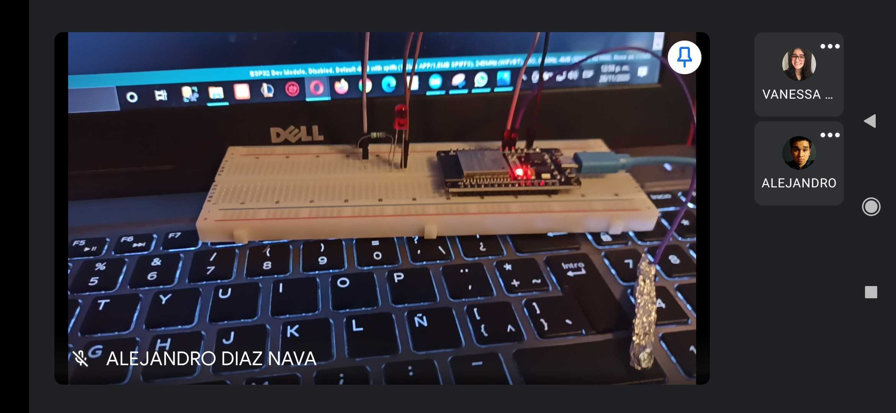

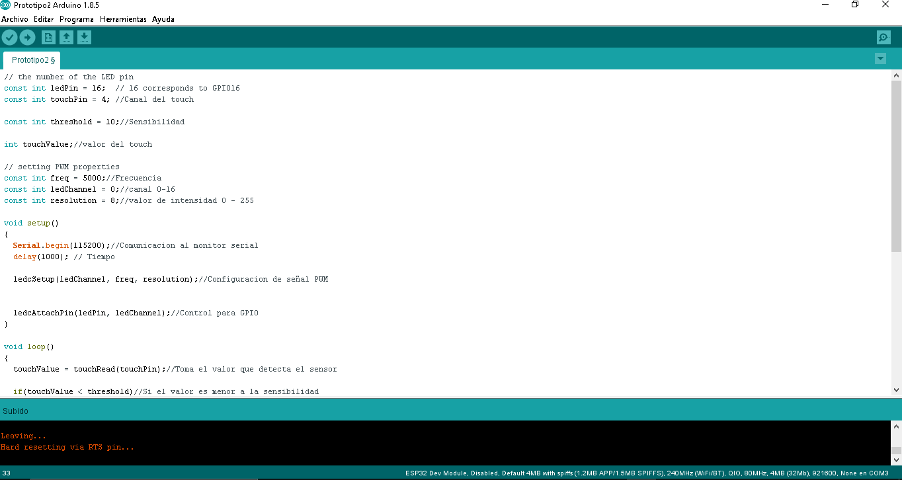
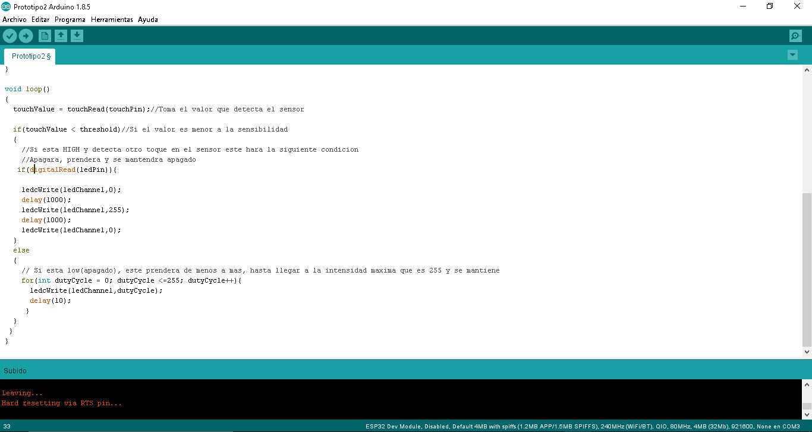

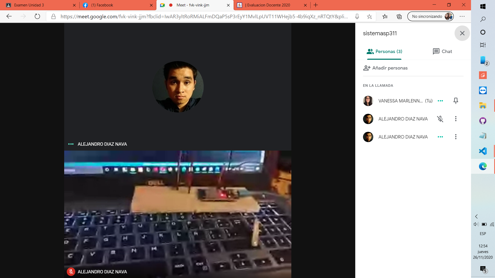
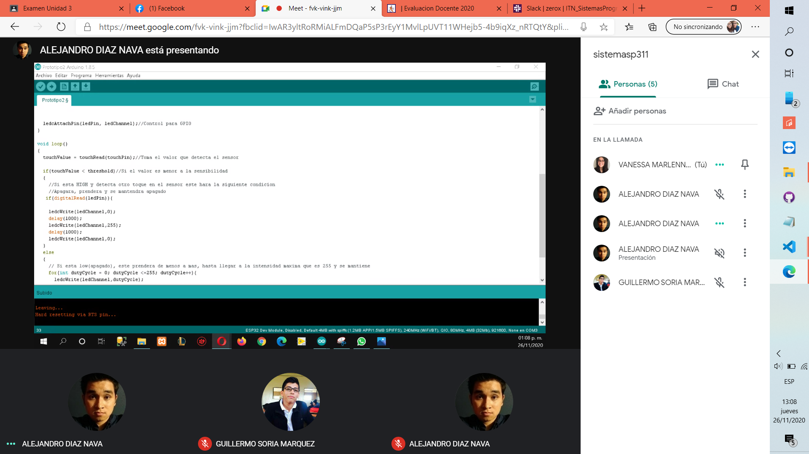
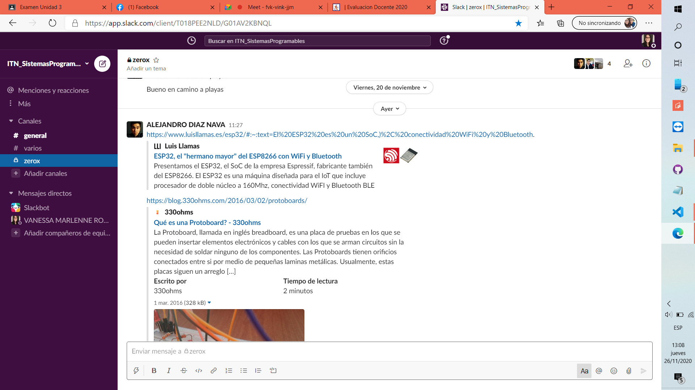
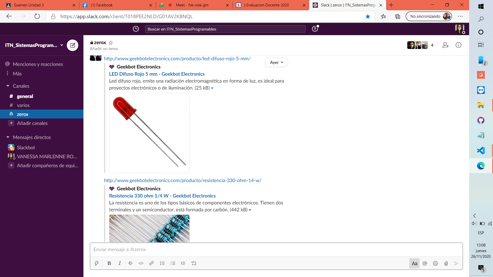
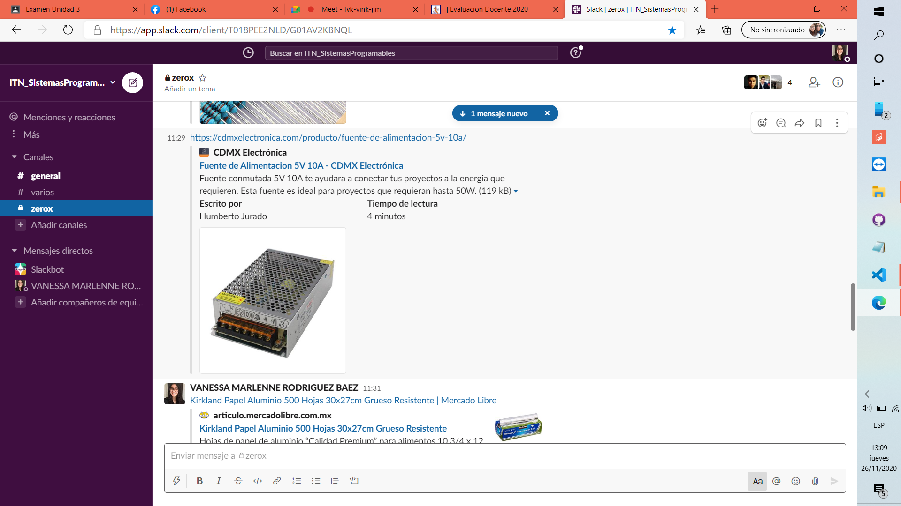
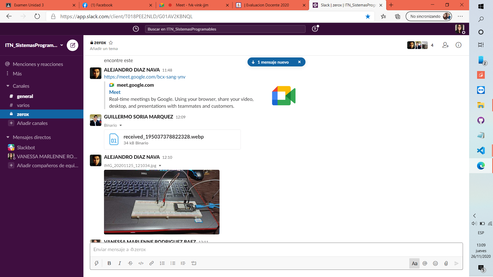
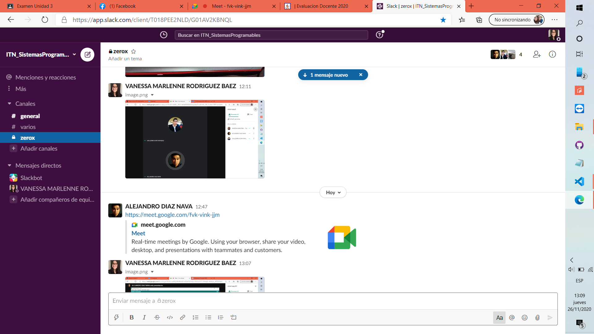
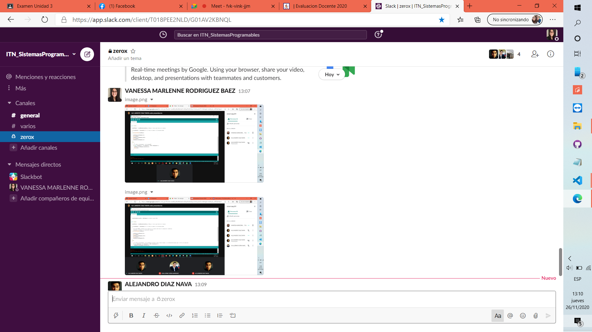
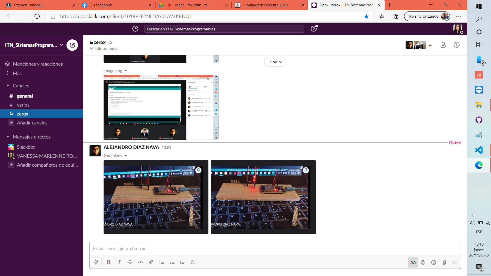

[Video Demostrativo](https://drive.google.com/file/d/12wxVzegiGYQwuhd8QNXWkHAMUl-ulVy4/view?usp=sharing)

4. **Conclusiones**

* **Diaz Navarro Alejandro:** En esta práctica que tuvimos que utilizar de manera un tanto mas compleja el módulo ESP32, tuve un tanto de problemas ya que es la primer ocasión donde me tocó programar, al principio fue sencillo hacer que led prendiera de la manera solicitada en la práctica, el problema fue que se mantuviera prendido una vez el sensor dejará de detectar que fue tocado, después de varios videos y leer algunos blogs, se logró hacer que el led se mantuviera encendido, al final se logró cumplir con la etapa de intermitencia, al final se logró cumplir con el objetivo solicitado.

* **Rodríguez Báez Vanessa Marlenne:** En esta practica se utilizo el ESP32 el cual jamás había trabajado con el, por eso se nos hizo muy complicada esta practica ya que la primera parte ya la teníamos por practicas pasadas pero la segunda parte se nos complico bastante hacer que el led se apagar y prendiera como debía, investigamos mucho y con ayuda de unos compañeros logramos hacer el código para esta practica por eso tardamos mas en esta practica por la investigación pero al final se logro el objetivo de dicha practica, De esta practica aprendí una de las tantas cosas que puede hacer el ESP32 ya que con un Arduino no se hubiera logrado igual se hubiera utilizado un botón como el sensor de touch.

* **Soria Márquez Guillermo:** En esta práctica volvimos a utilizar el ESP32 solo que con un poco mas de complejidad. Al momento de prender el led de menor a mayor intensidad no tuvimos problema alguno ya que en la práctica C.3.7 ya se había realizado algo similar, el problema fue que cuando estuviera prendido y tocáramos el sensor se tenía que apagar, volver a prender y apagar pero en nuestro caso no volvía a prender, modificamos el código pero nuevamente nos fallo el led prendía sin que hubiéramos tocado el sensor. Estuvimos investigando mucho sobre el código y fue por eso que esta práctica nos tomo un poco más de tiempo a comparación de prácticas pasadas pero al final si se obtuvo el resultado esperado
___

### :bomb: Rubrica

| Criterios     | Descripción                                                                                  | Puntaje |
| ------------- | -------------------------------------------------------------------------------------------- | ------- |
| Instrucciones | Se cumple con cada uno de los puntos indicados dentro del apartado Instrucciones?            | 10      |
| Desarrollo    | Se respondió a cada uno de los puntos solicitados dentro del desarrollo de la actividad?     | 60      |
| Demostración  | El alumno se presenta durante la explicación de la funcionalidad de la actividad?            | 20      |
| Conclusiones  | Se incluye una opinión personal de la actividad  por cada uno de los integrantes del equipo? | 10      |


:house: [Link  Díaz Navarro Alejandro](https://github.com/AlejandroDiaz96/SistemasProgramables2020)

:house: [Link Rodríguez Báez Vanessa Marlenne](https://github.com/vanessamRodriguez/Sistemas_Programables)

:house: [Link Soria Márquez Guillermo](https://github.com/GuillermoSoria97/Sistemas_P)
