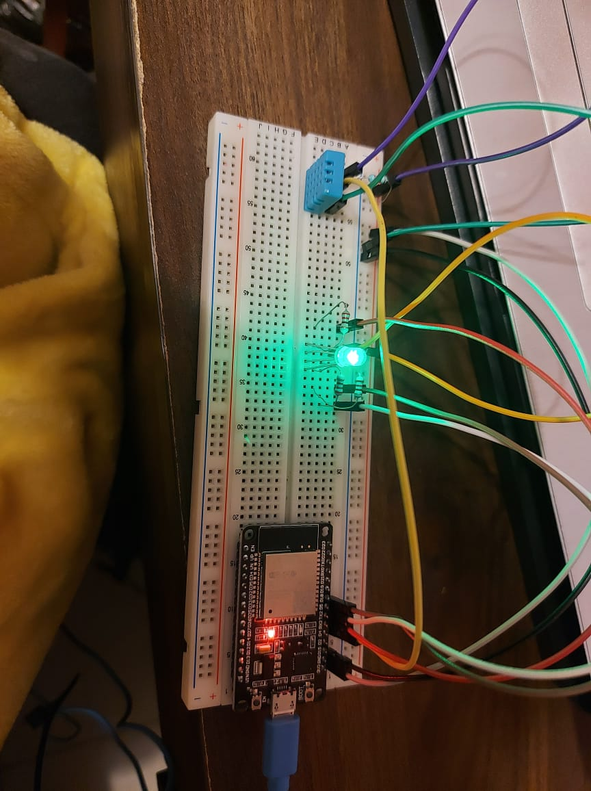
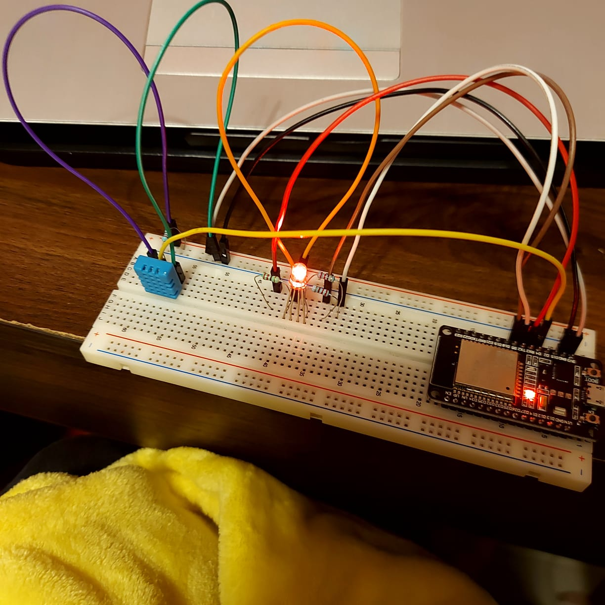
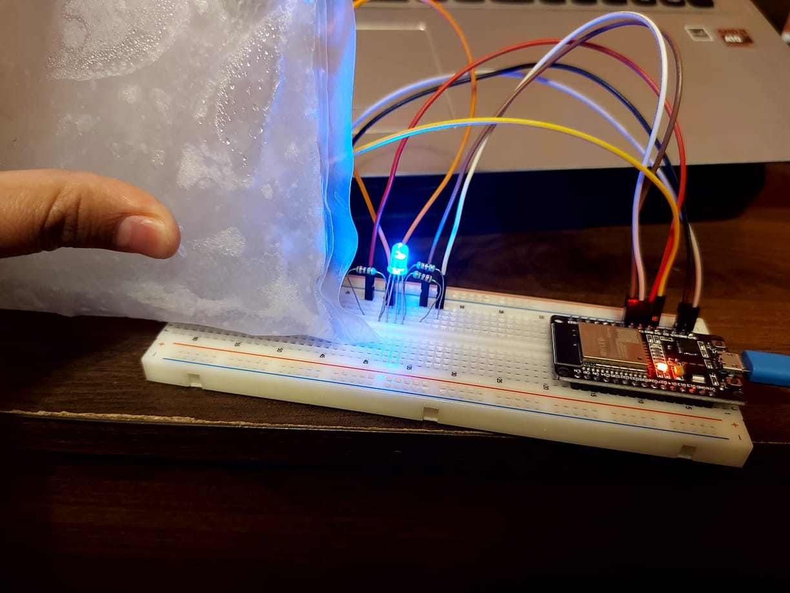
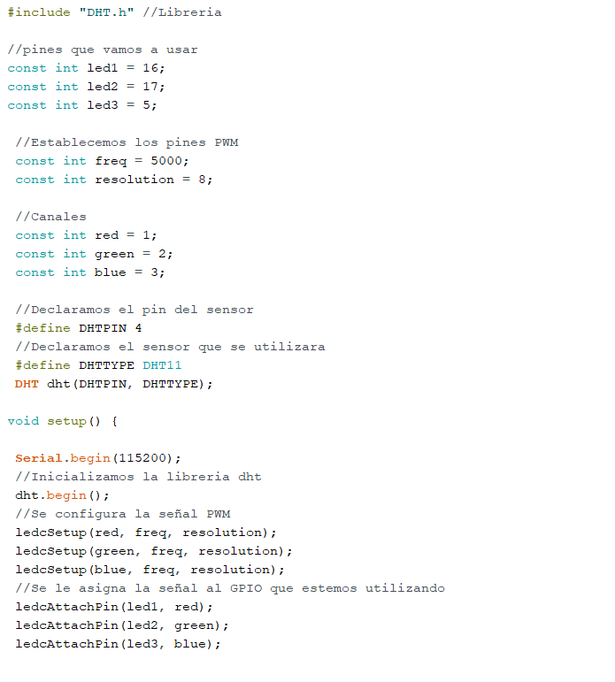
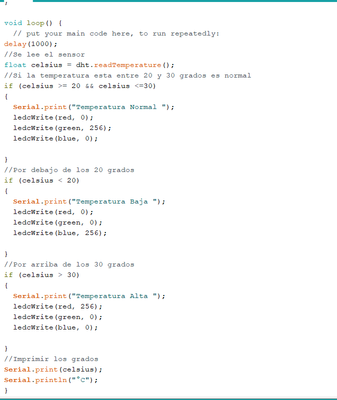
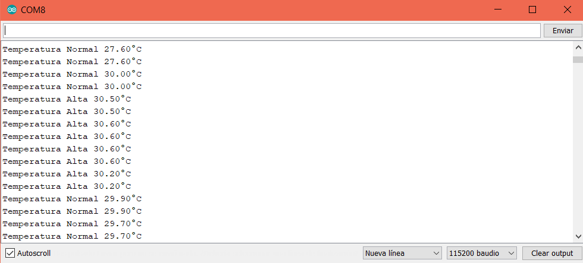
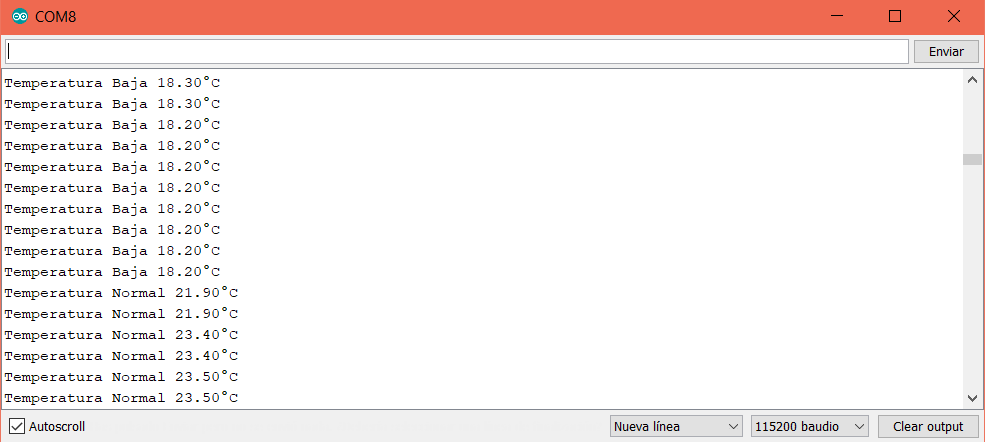
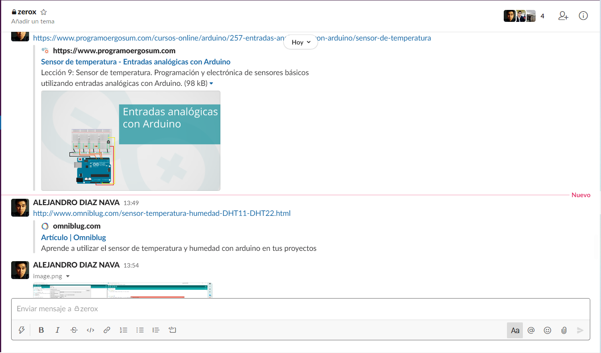
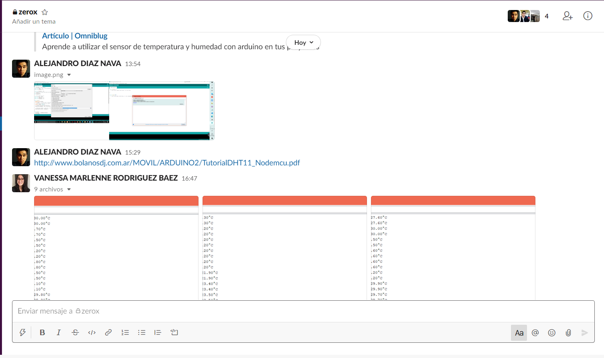
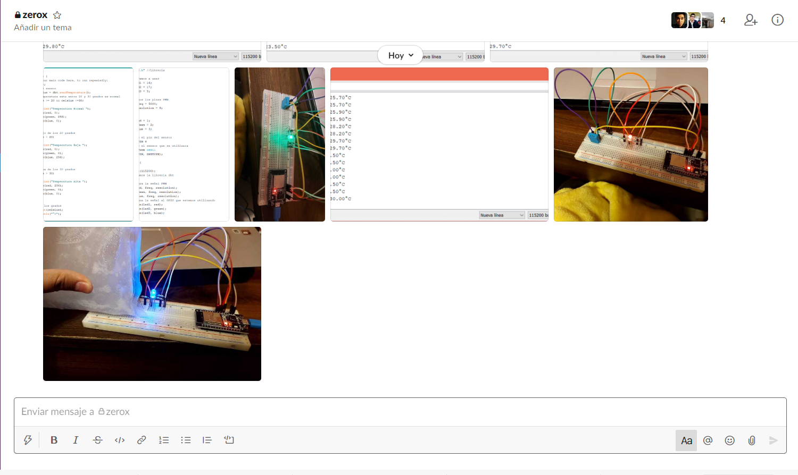

# :trophy: A.3.3 Actividad de aprendizaje

Circuito de medición de temperatura a través de un NodeMCU ESP32
___

## Instrucciones

- Basado en la figura 1, ensamblar un sistema, capaz de detectar la temperatura y humedad del ambiente, a través de un circuito electrónico, utilizando un NodeMCU **ESP32**, y un **Sensor DHT11/DHT22**.
- Toda actividad o reto se deberá realizar utilizando el estilo **MarkDown con extension .md** y el entorno de desarrollo VSCode, debiendo ser elaborado como un documento **single page**, es decir si el documento cuanta con imágenes, enlaces o cualquier documento externo debe ser accedido desde etiquetas y enlaces, y debe ser nombrado con la nomenclatura **A3.3_NombreApellido_Equipo.pdf.**
- Es requisito que el .md contenga una etiqueta del enlace al repositorio de su documento en GITHUB, por ejemplo **Enlace a mi GitHub** y al concluir el reto se deberá subir a github.
- Desde el archivo **.md** exporte un archivo **.pdf** que deberá subirse a classroom dentro de su apartado correspondiente, sirviendo como evidencia de su entrega, ya que siendo la plataforma **oficial** aquí se recibirá la calificación de su actividad.
- Considerando que el archivo .PDF, el cual fue obtenido desde archivo .MD, ambos deben ser idénticos.
- Su repositorio ademas de que debe contar con un archivo **readme**.md dentro de su directorio raíz, con la información como datos del estudiante, equipo de trabajo, materia, carrera, datos del asesor, e incluso logotipo o imágenes, debe tener un apartado de contenidos o indice, los cuales realmente son ligas o **enlaces a sus documentos .md**, _evite utilizar texto_ para indicar enlaces internos o externo.
- Se propone una estructura tal como esta indicada abajo, sin embargo puede utilizarse cualquier otra que le apoye para organizar su repositorio.
  
```
- readme.md
  - blog
    - C3.1_TituloActividad.md
    - C3.2_TituloActividad.md
    - C3.3_TituloActividad.md
    - C3.4_TituloActividad.md
    - C3.5_TituloActividad.md
    - C3.6_TituloActividad.md
    - C3.7_TituloActividad.md
    - C3.8_TituloActividad.md
  - img
  - docs
    - A3.1_TituloActividad.md
    - A3.2_TituloActividad.md
    - A3.3_TituloActividad.md
```

### Fuentes de apoyo para desarrollar la actividad:

   - [x] [Random Nerd Tutorial Touch pin](https://randomnerdtutorials.com/esp32-touch-pins-arduino-ide/)

   - [x] [Ejemplo de circuito con LED RGB Led](https://i0.wp.com/saber.patagoniatec.com/wp-content/uploads/2019/07/led-rgb-catodo-anado-comun.jpg)

___

## Desarrollo

1.Utilice el siguiente listado de materiales para la elaboración de la actividad

| Cantidad | Descripción                                                                                                                                                                                                                           |
| -------- | ------------------------------------------------------------------------------------------------------------------------------------------------------------------------------------------------------------------------------------- |
| 1        | [Sensor temperatura y humedad DHT11 o DHT22](https://articulo.mercadolibre.com.mx/MLM-664315278-sensor-de-temperatura-y-humedad-dht11-cjumpers-arduino-pic-_JM#position=1&type=item&tracking_id=b203e8cd-c375-429a-9b75-8c57e8b35386)  |
| 1        | [Diodo led RGB](https://www.prometec.net/rgb-led/)                                                                                                                                                                                                                        |
| 1        | [Resistencia 4.7k ohms](https://tostatronic.com/store/es/componentes-pasivos/893-resistencia-47k-ohms-14w.html)                                                                                                                                                                                                                 |
| 3        | [Resistencias 1k ohm](https://www.electrocomponentes.es/resistencias/resistencia-1k-ohm-025w-39-.html)                                                                                                                                                                                                                   |
| 1        | [Fuente de voltaje de 5V](https://cdmxelectronica.com/producto/fuente-de-alimentacion-5v-10a/)                                                                                                                                                                                                          |
| 1        | [NodeMCU ESP32](https://articulo.mercadolibre.com.mx/MLM-587686290-esp32-wifi-bluetooth-42-ble-nodemcu-esp8266-libro-gratis-_JM#position=1&type=item&tracking_id=84a6234b-5016-47eb-9950-39b49846ca72)                                |
| 1        | [BreadBoard](https://hetpro-store.com/TUTORIALES/protoboard-breadboard/)                                                                                                                                                                                                                            |
| 1        | [Jumpers M/M](https://teslabem.com/tienda/jumper-dupont-macho-macho-20cm-1-pieza-macho-macho/)                                                                                                                                                                                                                           |
       

1. Basado en las imágenes que se muestran en la **Figuras 1**, ensamble el circuito en un solo circuito electrónico, ide tal manera que se pueda obtener un sistema capaz de cumplir con las instrucciones antes solicitadas para esta actividad.
  

<p align="center"> 
    <strong>Figura 1 Circuito ESP32 y Sensor DHT</strong>
    
</p>

1.  Una vez ensamblado el circuito anterior, agregue un LED RGB y elabore el programa que le permita al LED RGB funcionar como indicador para las siguientes condiciones:
    - El sensor de temperatura en todo momento estará sensando, enviando el valor registrado por la terminal serial, por ejemplo "Temperatura ambiente: 25 grados" y el **LED RGB** estará encendido de color verde.
    - El sensor de temperatura al registrar un valor del ~20% por arriba de la temperatura ambiental, deberá mostrar el mensaje "Temperatura alta: ? grados" y el **LED RGB** se encenderá de color rojo.
    - El sensor de temperatura al registra un valor del ~20% por abajo de la temperatura ambiental, deberá mostrar el mensaje "Temperatura baja: ? grados" y el **LED RGB** se encenderá de color azul.
2. Coloque aquí evidencias que considere importantes durante el desarrollo de la actividad.

## Circuito armado y funcionando
 Temperatura ambiental

 Temperatura Alta

Temperatura Baja

## Codigo




## Monitor Serial




## Video Demostrativo 
[A3.3 Circuito de medicion de temperatura a traves de un NodeMCU ESP32](https://drive.google.com/file/d/1HpWCZCT4yCr_WfOX6DkFURm268-K3AIu/view?usp=sharing)

## Slack y Meet






## Conclusiones

* **Diaz Navarro Alejandro:** En esta práctica se tuvo un problema con el uso de ide de arduino, pero se soluciono con una investigación, al final fue un problema de la versión se tuvo que instalar la versión 1.8.5 de este mismo, después se busco una librería para que pudiese tomar las mediciones del sensor DHT11, de igual manera se investigó cómo conectar el LED RGB, y como configurarlo, haciendo uso de los conociminento obtenidos con practicas anteriores se pudo relizar que el led cambiara de color dependiendo de la temperatura medida.
Así que los conocimientos que obtuve fue como hacer que estos componentes interactúan entre ellos para llegar al resultado esperado
* **Rodríguez Báez Vanessa Marlenne:** En esta practica se volvió a utilizar el ESP32 pero ahora con un sensor DHT11 que fue el que nosotros utilizamos y un led RGB, con el ESP32 ya sabemos como funciona pero en mi caso jamás había utilizado el sensor DHT11 ni el led RGB por lo que tuvimos que investigar mucho sobre esos 2 componentes, Una de las cosas en las que mas se nos complico fue hacer que la computadora y el IDE de Arduino detectara el ESP32 en la computadora y al igual que las librerías, después de una investigación y de instalar de nuevo el Arduino funciono, otro contratiempo fue que el led RGB me prendía todos los colores y no podía hacer que solo 1 se quedara prendido pero ya una vez solucionado funciono como indica la practica. En esta practica aprendí a utilizar otro sensor y como programarlo al igual de la utilización del led RGB.
* **Soria Márquez Guillermo:** En esta práctica utilizamos en sensor de temperatura DHT11 junto con el ESP32 para analizar el cambio de temperatura mediante un diodo RGB.  Sobre el ESP32 ya teníamos un poco de noción de su funcionamiento gracias a la practicas pasadas, pero el sensor DHT11 era completamente nuevo para nosotros, al momento de ensamblar tuvimos problemas ya que el IDE del arduino de la computadora en la que se realizo no detectaba ya que era de una versión diferente, igual tuvimos problema con la conexión del led. Tuvimos que investigar mucho ya que desconocíamos varios componentes con los que se trabajaron, pero al final se obtuvo el resultado esperado.

___

### :bomb: Rubrica

| Criterios     | Descripción                                                                                  | Puntaje |
| ------------- | -------------------------------------------------------------------------------------------- | ------- |
| Instrucciones | Se cumple con cada uno de los puntos indicados dentro del apartado Instrucciones?            | 10      |
| Desarrollo    | Se respondió a cada uno de los puntos solicitados dentro del desarrollo de la actividad?     | 60      |
| Demostración  | El alumno se presenta durante la explicación de la funcionalidad de la actividad?            | 20      |
| Conclusiones  | Se incluye una opinión personal de la actividad  por cada uno de los integrantes del equipo? | 10      |

:house: [Link  Díaz Navarro Alejandro](https://github.com/AlejandroDiaz96/SistemasProgramables2020)

:house: [Link Rodríguez Báez Vanessa Marlenne](https://github.com/vanessamRodriguez/Sistemas_Programables)

:house: [Link Soria Márquez Guillermo](https://github.com/GuillermoSoria97/Sistemas_P)
