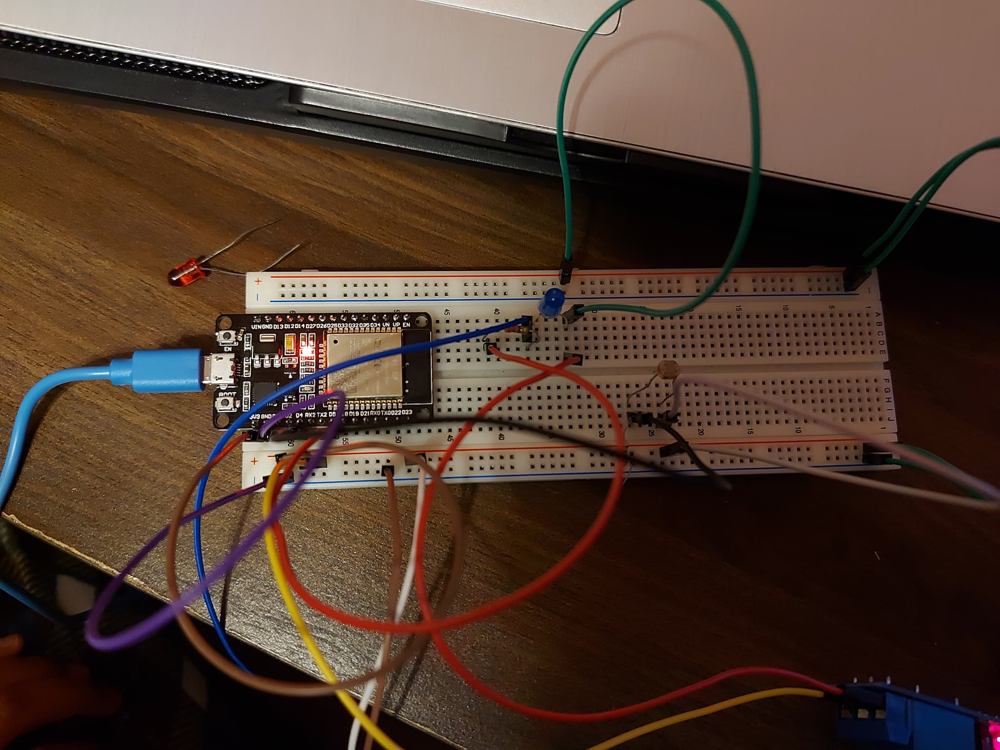

# :trophy: A4.2 Actividad de aprendizaje

Circuito sensor de iluminación y actuación de luz NodeMCU ESP32 por medio de Wi-Fi
___

## Instrucciones

- Realizar un sistema de medición y actuación de luz ambiental, utilizando el protocolo de comunicación **Wi-FI**, asi como un NodeMCU **ESP32**, un sensor  **LDR**, un diodo LED.
- Toda actividad o reto se deberá realizar utilizando el estilo **MarkDown con extension .md** y el entorno de desarrollo VSCode, debiendo ser elaborado como un documento **single page**, es decir si el documento cuanta con imágenes, enlaces o cualquier documento externo debe ser accedido desde etiquetas y enlaces, y debe ser nombrado con la nomenclatura **A4.2_NombreApellido_Equipo.pdf.**
- Es requisito que el .md contenga una etiqueta del enlace al repositorio de su documento en GITHUB, por ejemplo **Enlace a mi GitHub** y al concluir el reto se deberá subir a github.
- Desde el archivo **.md** exporte un archivo **.pdf** que deberá subirse a classroom dentro de su apartado correspondiente, sirviendo como evidencia de su entrega, ya que siendo la plataforma **oficial** aquí se recibirá la calificación de su actividad.
- Considerando que el archivo .PDF, el cual fue obtenido desde archivo .MD, ambos deben ser idénticos.
- Su repositorio ademas de que debe contar con un archivo **readme**.md dentro de su directorio raíz, con la información como datos del estudiante, equipo de trabajo, materia, carrera, datos del asesor, e incluso logotipo o imágenes, debe tener un apartado de contenidos o indice, los cuales realmente son ligas o **enlaces a sus documentos .md**, _evite utilizar texto_ para indicar enlaces internos o externo.
- Se propone una estructura tal como esta indicada abajo, sin embargo puede utilizarse cualquier otra que le apoye para organizar su repositorio.
  
```
- readme.md
  - blog
    - C4.1_TituloActividad.md
    - C4.2_TituloActividad.md
    - C4.3_TituloActividad.md
    - C4.4_TituloActividad.md    
  - img
  - docs
    - A4.1_TituloActividad.md
    - A4.2_TituloActividad.md
    - A4.3_TituloActividad.md
```
___

### Fuentes de apoyo para desarrollar la actividad

   - [x] [ESP32 Web Server](https://randomnerdtutorials.com/esp32-web-server-arduino-ide/)
   - [x] [LDR con ESP32](https://www.youtube.com/watch?v=A3qcN2mzv0Q)
   
___

## Desarrollo

1.Utilizar el siguiente listado de materiales para la elaboración de la actividad

| Cantidad | Descripción    |
| -------- | -------------- |
| 1        | [Modulo Sensor LDR](https://articulo.mercadolibre.com.mx/MLM-623282168-modulo-sensor-de-luz-ldr-_JM)             |
| 1 | [Rele de 3.3v](https://es.aliexpress.com/item/4000332075516.html?spm=a2g0o.productlist.0.0.6eb02fb2W0Q3tU&algo_pvid=dcb084b0-9f9e-4193-a18c-2d99a8ee113d&algo_expid=dcb084b0-9f9e-4193-a18c-2d99a8ee113d-0&btsid=0bb0624716079791705592946e4fcf&ws_ab_test=searchweb0_0,searchweb201602_,searchweb201603_) |
| 1 | [Bombilla](https://www.ledtecnologia.com/que-es-un-led/)  |
| 1        | [Fuente de voltaje de 5V ](https://cdmxelectronica.com/producto/fuente-de-alimentacion-5v-10a/)                                                                                                                               |
| 1        | [NodeMCU ESP32](https://www.amazon.com.mx/ESP-32-ESP-32S-ESP-WROOM-32-ESP32-S-desarrollo/dp/B07TBFC75Z/ref=sr_1_2?__mk_es_MX=%C3%85M%C3%85%C5%BD%C3%95%C3%91&dchild=1&keywords=esp32&qid=1599003438&sr=8-2)                |
| 1        | [BreadBoard](https://www.amazon.com.mx/Deke-Home-Breadboard-distribuci%C3%B3n-electr%C3%B3nica/dp/B086C9HK7V/ref=sr_1_22?__mk_es_MX=%C3%85M%C3%85%C5%BD%C3%95%C3%91&dchild=1&keywords=breadboard&qid=1599003455&sr=8-22)   |
| 1        | [Jumpers M/M](https://www.amazon.com.mx/ELEGOO-Macho-Hembra-Macho-Macho-Hembra-Hembra-Protoboard/dp/B06ZXSQ5WG/ref=sr_1_1?__mk_es_MX=%C3%85M%C3%85%C5%BD%C3%95%C3%91&dchild=1&keywords=jumper+wires&qid=1599003519&sr=8-1) |

2. Basado en la imágen que se muestran en las **Figura 1**, ensamble un circuito electrónico y agregue un Led y un rele a una de las terminales del dispositivo, de tal manera que se pueda obtener un sistema capaz de cumplir con las instrucciones siguiente:
    - Se deberá utilizar el NodeMCU como un **standalone Web server**, el cual deberá proveer una interface visual, que mostrara una imagen representando un comportamiento de "ON y OFF" dependiendo de la condición de iluminación ambiental.
    - El sensor de iluminación deberá estar midiendo la cantidad de luz que existen en el ambiente.
    - Al momento de detectar el sensor LDR, ausencia de luz deberá mostrar en la interface Web un estado "ON", y en caso contrario deberá representarse el estado "OFF".
    - Al circuito de la figura 1 se le deberá agregar un relevador en serie con una bombilla, que sera activada en condición opuesta al estado "ON" y "OFF", es decir una vez que el sensor detecto poca o nula iluminación activara el rele y por consecuencia encenderá la bombilla, y en caso contrario lo apagara.

[Fuente de apoyo Random Nerd Tutorial](https://randomnerdtutorials.com/esp32-web-server-arduino-ide/)
    
<p align="center"> 
    <strong>Figura 1 Circuito ESP32 Sensor LDR iluminacion</strong>
    
</p>

3. Coloque aquí la imagen del circuito ensamblado
   
   
   
4. Coloque en este lugar el programa creado dentro del entorno de Arduino
```C++
#define BLYNK_PRINT Serial

#include <WiFi.h>
#include <WiFiClient.h>
#include <BlynkSimpleEsp32.h>


const int led = 4;
const int  sensor = 5;
char auth[] ="MuWSnVz5XoclyBMk6dLp8Jf5NGbu4pi7";
char ssid[] = "INFINITUM7773";
char password[] = "7AK4Te3Lot";
BlynkTimer timer;


void setup()
{
  // Debug console
  pinMode(led, OUTPUT);
  Serial.begin(9600);
  Blynk.begin(auth, ssid, password);
  timer.setInterval(500L, sendSensor);

}

void loop()
{
  Blynk.run();
  timer.run();
}

void sendSensor()
{
  int LDR = analogRead(sensor);
    if(LDR <150)
  {
    digitalWrite(led, HIGH);
    Blynk.notify("Led Encendido");
  }
  else
  {
    digitalWrite(led, LOW);
   
  }

  Blynk.virtualWrite(V5, LDR);

}
```

5. Coloque aquí evidencias que considere importantes durante el desarrollo de la actividad.

[Video Demostrativo](https://youtu.be/C4hvmwRtPmM)
### Aplicación Blynk 


### Slack


### Reunión


### 6.- conclusiones
* **Diaz Navarro Alejandro:**
*  **Rodríguez Báez Vanessa Marlenne:** En esta practica se realizo algo parecido en la practica pasada pero ahora con un reley y el led prendiera y apagara con una LCD y se mostrara en la pagina web, Nosotros tuvimos que utilizar la aplicación de Blynk para poder hacer la conexión y nos manda una notificación del comportamiento del led, esto debido a el código que teníamos para un Web Server al momento de querer pasarlo al ESP32 No me detectaba la placa en la computadora, lo intentamos en otra computadora pero de igual forma no se pudo lograr, es por eso que decidimos realizar esta practica con el Blynk, De esta practica aprendí a utilizar una nueva aplicación para realizar la conexión al esp32 por wifi, al igual del comportamiento del reley y como se conecta.
  
*  **Soria Márquez Guillermo:**
___

### :bomb: Rubrica

| Criterios     | Descripción                                                                                  | Puntaje |
| ------------- | -------------------------------------------------------------------------------------------- | ------- |
| Instrucciones | Se cumple con cada uno de los puntos indicados dentro del apartado Instrucciones?            | 10      |
| Desarrollo    | Se respondió a cada uno de los puntos solicitados dentro del desarrollo de la actividad?     | 60      |
| Demostración  | El alumno se presenta durante la explicación de la funcionalidad de la actividad?            | 20      |
| Conclusiones  | Se incluye una opinión personal de la actividad  por cada uno de los integrantes del equipo? | 10      |


:house: [Link  Díaz Navarro Alejandro](https://github.com/AlejandroDiaz96/SistemasProgramables2020)

:house: [Link Rodríguez Báez Vanessa Marlenne](https://github.com/vanessamRodriguez/Sistemas_Programables)

:house: [Link Soria Márquez Guillermo](https://github.com/GuillermoSoria97/Sistemas_P)