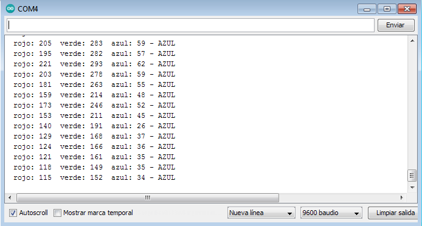

# :trophy: A5.2 Actividad de aprendizaje

Sistema sensor y actuacion del color de un objeto, e interface visual
___

## Instrucciones

- Realizar un sistema de identificacion de color utilizando un sensor de RGB TCS34725, un nodeMCU ESP32, un actuador Servomotor SG90, cualquier protocolo de comunicación y una interface visual que puede ser desarrollada por el equipo o apoyandose de otras como Node-red por ejemplo.
- Toda actividad o reto se deberá realizar utilizando el estilo **MarkDown con extension .md** y el entorno de desarrollo VSCode, debiendo ser elaborado como un documento **single page**, es decir si el documento cuanta con imágenes, enlaces o cualquier documento externo debe ser accedido desde etiquetas y enlaces, y debe ser nombrado con la nomenclatura **A5.2_NombreApellido_Equipo.pdf.**
- Es requisito que el .md contenga una etiqueta del enlace al repositorio de su documento en GITHUB, por ejemplo **Enlace a mi GitHub** y al concluir el reto se deberá subir a github.
- Desde el archivo **.md** exporte un archivo **.pdf** que deberá subirse a classroom dentro de su apartado correspondiente, sirviendo como evidencia de su entrega, ya que siendo la plataforma **oficial** aquí se recibirá la calificación de su actividad.
- Considerando que el archivo .PDF, el cual fue obtenido desde archivo .MD, ambos deben ser idénticos.
- Su repositorio ademas de que debe contar con un archivo **readme**.md dentro de su directorio raíz, con la información como datos del estudiante, equipo de trabajo, materia, carrera, datos del asesor, e incluso logotipo o imágenes, debe tener un apartado de contenidos o indice, los cuales realmente son ligas o **enlaces a sus documentos .md**, _evite utilizar texto_ para indicar enlaces internos o externo.
- Se propone una estructura tal como esta indicada abajo, sin embargo puede utilizarse cualquier otra que le apoye para organizar su repositorio.
  
```
- readme.md
  - blog
    - C5.1_TituloActividad.md
    - C5.2_TituloActividad.md    
  - img
  - docs
    - A5.1_TituloActividad.md
    - A5.2_TituloActividad.md    
```

___

## Desarrollo

1. Utilizar el siguiente listado de materiales para la elaboración de la actividad

| Cantidad | Descripción    |
| -------- | -------------- |
| 1        | [Sensor RGB TCS34725](https://www.luisllamas.es/arduino-sensor-color-rgb-tcs34725/) |
| 1 | [Servomotor SG90](https://sandorobotics.com/producto/sg90/)  |
| 1        | [Fuente de voltaje de 5V](https://cdmxelectronica.com/producto/fuente-de-alimentacion-5v-10a/)                                                                                                                               |
| 1        | [NodeMCU ESP32](https://www.amazon.com.mx/ESP-32-ESP-32S-ESP-WROOM-32-ESP32-S-desarrollo/dp/B07TBFC75Z/ref=sr_1_2?__mk_es_MX=%C3%85M%C3%85%C5%BD%C3%95%C3%91&dchild=1&keywords=esp32&qid=1599003438&sr=8-2)                |
| 1        | [BreadBoard](https://www.amazon.com.mx/Deke-Home-Breadboard-distribuci%C3%B3n-electr%C3%B3nica/dp/B086C9HK7V/ref=sr_1_22?__mk_es_MX=%C3%85M%C3%85%C5%BD%C3%95%C3%91&dchild=1&keywords=breadboard&qid=1599003455&sr=8-22)   |
| 1        | [Jumpers M/M](https://www.amazon.com.mx/ELEGOO-Macho-Hembra-Macho-Macho-Hembra-Hembra-Protoboard/dp/B06ZXSQ5WG/ref=sr_1_1?__mk_es_MX=%C3%85M%C3%85%C5%BD%C3%95%C3%91&dchild=1&keywords=jumper+wires&qid=1599003519&sr=8-1) |

2. Basado en las imágenes que se muestran en las **Figura 1**, realizar un sistema capaz de cumplir con las siguientes condiciones:
   
   - La primer fase de la actividad consistira en, al colocar un objeto frente al sensor RGB, este debera identificar que color tiene (es recomendable utiizar objetos de color Rojo, Verde, y Azul para mayor precision), el cual debera mostrar en un interface visual que color fue detectado.
   - La segunda fase, consistira en agregar un actuador que y un identificador de color apoyandose de una banda de colores como se muestra en la imagen 1; al conocer el color del objeto el actuador debera apuntar al color que se esta detectando.

 <p align="center"> 
    <strong>Figura 1 Circuito ESP32 Sensor de color y Servomotor</strong>
    
</p>

3. Coloque aquí la imagen del circuito ensamblado
   

4. Coloque en este lugar el programa creado dentro del entorno de Arduino
```C++
#include <Servo.h>

Servo servoMotor;

const int s0 = 8;  
const int s1 = 13;  
const int s2 = 12;  
const int s3 = 11;  
const int out = 10; 
 
int pos = 0;
int pos1 = 90;
int pos2 =180;  
int rojo = 0;  
int verde = 0;  
int azul = 0;  
  
void setup(){  
  Serial.begin(9600); 
  pinMode(s0, OUTPUT);  
  pinMode(s1, OUTPUT);  
  pinMode(s2, OUTPUT);  
  pinMode(s3, OUTPUT);  
  pinMode(out, INPUT);   
  digitalWrite(s0, HIGH);  
  digitalWrite(s1, HIGH); 
servoMotor.attach(9);
   
}  

void loop(){  
  color(); 
  Serial.print("  rojo: ");  
  Serial.print(rojo, DEC);  
  Serial.print("  verde: ");  
  Serial.print(verde, DEC);  
  Serial.print("  azul: ");  
  Serial.print(azul, DEC);  

 
  if (rojo > azul && verde > 100 && rojo < 80) 
  {  
   Serial.println(" - ROJO");
   
  servoMotor.write(pos);
     
  }   
  else if (rojo > 100 && verde > 100 && azul < 100)  
  {  
   Serial.println(" - AZUL"); 
   servoMotor.write(pos2);
  
        
  }  
  else if(rojo < 100  && verde < 80 && azul < 80) 
  {  
   Serial.println(" - VERDE");
    servoMotor.write(pos1);
       
  }  
  else{
  Serial.println("-");  
  }
  delay(300);     
  }  
    
void color()  
{    
  digitalWrite(s2, LOW);  
  digitalWrite(s3, LOW);   
  rojo = pulseIn(out, digitalRead(out) == HIGH ? LOW : HIGH);  
  digitalWrite(s3, HIGH);   
  azul = pulseIn(out, digitalRead(out) == HIGH ? LOW : HIGH);  
  digitalWrite(s2, HIGH);    
  verde = pulseIn(out, digitalRead(out) == HIGH ? LOW : HIGH);  
}
```
5. Coloque aquí evidencias que considere importantes durante el desarrollo de la actividad.
## Monitor Serial 




## Reunión 


## Slack


6. Para la demostracion de la actividad deberan utilizarse mas de un objeto para poder cubrir minimo tres colores.

[Video demostrativo](https://youtu.be/ndkACcnI_K4)
___

## Conclusiones 

**Diaz Navarro Alejandro:**

**Rodríguez Báez Vanessa Marlenne:**
Al ser la ultima practica teníamos que utilizar todos los conocimientos adquiridos en este semestre, tuvimos problemas con el ESP32 por lo cual tuvimos que utilizar un Arduino para lograr la practica y entregar algo, también se utilizo el sensor de colores TCS3200 y un servo motor, primero se configuro el sensor para que se detectara los colores el en monitor serial se tuvo problemas al detectar el color verde después de varios ajustes se logro detectar, Después se incorporo el servo motor el cual se configuro para que señale cada color depende lo que diga el sensor, ya que no pudimos utilizar el node-red no se cumplió con todo lo que quería la practica, Pero se logro que aprendiéramos a utilizar el sensor TCS3200 y un servomotor.
**Soria Márquez Guillermo:**

### :bomb: Rubrica

| Criterios     | Descripción                                                                                  | Puntaje |
| ------------- | -------------------------------------------------------------------------------------------- | ------- |
| Instrucciones | Se cumple con cada uno de los puntos indicados dentro del apartado Instrucciones?            | 10      |
| Desarrollo    | Se respondió a cada uno de los puntos solicitados dentro del desarrollo de la actividad?     | 60      |
| Demostración  | El alumno se presenta durante la explicación de la funcionalidad de la actividad?            | 20      |
| Conclusiones  | Se incluye una opinión personal de la actividad  por cada uno de los integrantes del equipo? | 10      |

:house: [Link  Díaz Navarro Alejandro](https://github.com/AlejandroDiaz96/SistemasProgramables2020)

:house: [Link Rodríguez Báez Vanessa Marlenne](https://github.com/vanessamRodriguez/Sistemas_Programables)

:house: [Link Soria Márquez Guillermo](https://github.com/GuillermoSoria97/Sistemas_P)